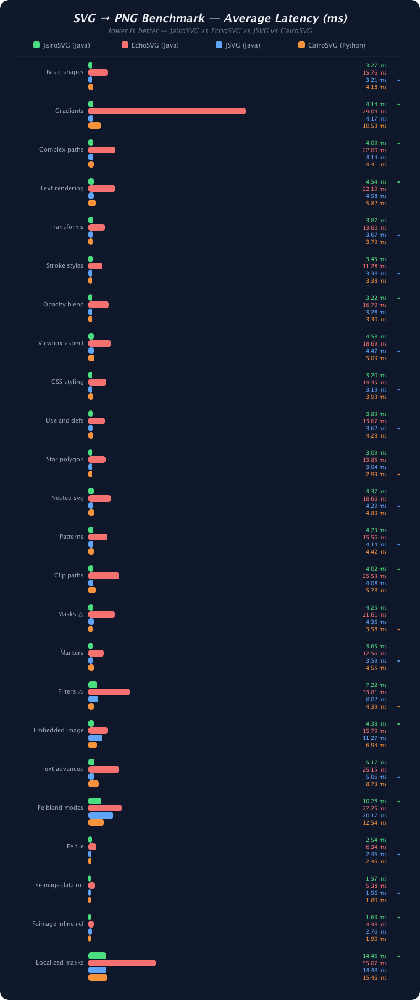
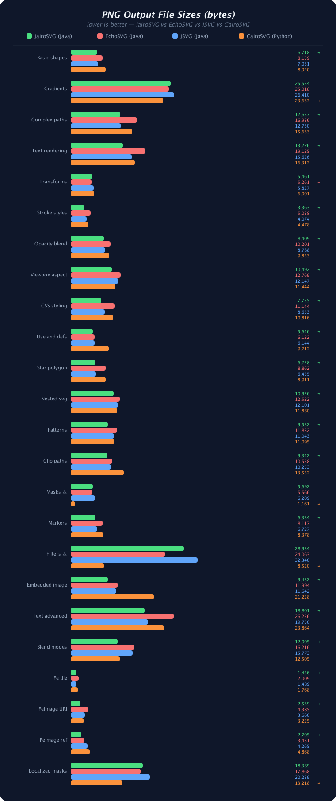

# JairoSVG

[](https://github.com/brunoborges/jairosvg/actions/workflows/ci.yml)
[](https://central.sonatype.com/artifact/io.brunoborges/jairosvg)
[](https://javadoc.io/doc/io.brunoborges/jairosvg)
[](https://www.gnu.org/licenses/lgpl-3.0)
[](https://openjdk.org/)

A high-performance Java port of [CairoSVG](https://cairosvg.org) — SVG 1.1 to PNG, JPEG, TIFF, PDF, and PS/EPS converter powered by Java2D.

## Features

- 🎨 **SVG 1.1 rendering** using Java2D — no native dependencies
- 📄 **Multiple output formats**: PNG, JPEG, TIFF, PDF (via optional [Apache PDFBox](https://pdfbox.apache.org/)), PostScript/EPS
- 🔷 **Full shape support**: rect, circle, ellipse, line, polygon, polyline, path
- 🌈 **Gradients**: linear and radial with stop colors and opacity
- ✍️ **Text rendering** with font control, letter-spacing, text-anchor
- 🔄 **Transforms**: translate, rotate, scale, skew, matrix
- 🎭 **Advanced features**: clip-path, viewBox, preserveAspectRatio, `<use>`, CSS stylesheets
- ⚡ **Fast**: 2-31x faster than EchoSVG (Batik fork), on par with JSVG, 1.1-2.5x faster than CairoSVG's native C backend
- 🛡️ **Secure**: XML external entity (XXE) protection by default
- 🧰 **Flexible API**: Static methods, fluent builder, CLI

## Benchmark and Feature Comparison

<p align="center">
  <a href="comparison/benchmark.png"></a>
  &nbsp;&nbsp;
  <a href="comparison/benchmark-size.png"></a>
  <br/><sub><i>Click to enlarge</i></sub>
</p>

### Sample SVG → PNG conversion benchmark (lower is better):

| Test Case                | JairoSVG (Java) | EchoSVG (Java) | CairoSVG (Python) |
| ------------------------ | :-------------: | :------------: | :---------------: |
| Simple shapes            |   **3.5 ms**    |    16.6 ms     |      4.3 ms       |
| Gradients                |   **4.3 ms**    |   134.8 ms     |     11.3 ms       |
| Complex paths + text     |   **4.7 ms**    |    23.0 ms     |      5.4 ms       |
| Defs + use + clipPath    |   **4.1 ms**    |    20.4 ms     |      5.2 ms       |
| Markers + strokes        |   **3.8 ms**    |    12.5 ms     |      4.1 ms       |

_JairoSVG is 2–31× faster than EchoSVG, on par with JSVG, and 1–2.5× faster than CairoSVG's native C backend._

Run the benchmark yourself: `jbang comparison/benchmark.java`.

See **[comparison/README.md](comparison/README.md)** for full benchmark results, PNG file size comparisons, and feature matrices across JairoSVG, CairoSVG, and EchoSVG.

## Installation

### Maven

```xml
<dependency>
    <groupId>io.brunoborges</groupId>
    <artifactId>jairosvg</artifactId>
    <version>1.0.2</version>
</dependency>
```

> **Note:** PDF output requires [Apache PDFBox](https://pdfbox.apache.org/) on the classpath. It is an **optional** dependency — if you only need PNG, JPEG, TIFF, or PS/EPS output, you do not need to add PDFBox. To enable PDF support, add it explicitly:
>
> ```xml
> <dependency>
>     <groupId>org.apache.pdfbox</groupId>
>     <artifactId>pdfbox</artifactId>
>     <version>3.0.6</version>
> </dependency>
> ```

### Gradle

```groovy
implementation 'io.brunoborges:jairosvg:1.0.2'
```

### JBang (quick run)

```bash
jbang --deps io.brunoborges:jairosvg:1.0.2 MyScript.java
```

## Quick Start

### Library API

```java
import io.brunoborges.jairosvg.JairoSVG;

// SVG bytes → PNG bytes
byte[] png = JairoSVG.svg2png(svgBytes);

// SVG file → PDF file
JairoSVG.svg2pdf(Path.of("input.svg"), Path.of("output.pdf"));

// Builder API with options
byte[] scaled = JairoSVG.builder()
    .fromBytes(svgBytes)
    .dpi(150)
    .scale(2)
    .backgroundColor("#ffffff")
    .toPng();

// Control image compression/quality
byte[] fastPng = JairoSVG.builder()
    .fromFile(Path.of("icon.svg"))
    .pngCompressionLevel(1)   // 0 (fastest) to 9 (smallest)
    .toPng();

byte[] highQualityJpeg = JairoSVG.builder()
    .fromFile(Path.of("photo.svg"))
    .jpegQuality(0.95f)       // 0.0 (smallest) to 1.0 (best)
    .toJpeg();

// Get BufferedImage directly
BufferedImage image = JairoSVG.builder()
    .fromFile(Path.of("icon.svg"))
    .toImage();

// Customize Java2D rendering hints
import java.awt.RenderingHints;

byte[] quality = JairoSVG.builder()
    .fromBytes(svgBytes)
    .renderingHint(RenderingHints.KEY_RENDERING, RenderingHints.VALUE_RENDER_QUALITY)
    .toPng();
```

### Command Line

Install with JBang
```bash
jbang app install io.brunoborges:jairosvg:LATEST

# SVG → PNG
jairosvg input.svg -o output.png

# SVG → PDF with 2x scale
java input.svg -f pdf -s 2 -o output.pdf
```

Manually build:
```bash
# Build the CLI
mvn package

# SVG → PNG
java --enable-preview -jar target/jairosvg-1.0.2-cli.jar input.svg -o output.png

# SVG → PDF with 2x scale
java --enable-preview -jar target/jairosvg-1.0.2-cli.jar input.svg -f pdf -s 2 -o output.pdf
```

Build a GraalVM native CLI:
```bash
# Create native executable from the shaded CLI JAR
# Required native-image arguments are read from the JAR's META-INF/native-image config
native-image -jar target/jairosvg-1.0.2-cli.jar
./jairosvg input.svg -o output.png
```

### CLI Options

| Option                   | Description                                                     |
| ------------------------ | --------------------------------------------------------------- |
| `-o, --output FILE`      | Output filename                                                 |
| `-f, --format FORMAT`    | Output format: `png`, `jpeg`, `tiff`, `pdf`, `ps`, `eps` |
| `-d, --dpi DPI`          | Resolution (default: 96)                                        |
| `-s, --scale FACTOR`     | Scale factor (default: 1)                                       |
| `-b, --background COLOR` | Background color                                                |
| `-W, --width PIXELS`     | Parent container width                                          |
| `-H, --height PIXELS`    | Parent container height                                         |
| `--output-width PIXELS`  | Desired output width                                            |
| `--output-height PIXELS` | Desired output height                                           |
| `-n, --negate-colors`    | Negate vector colors                                            |
| `-i, --invert-images`    | Invert raster image colors                                      |
| `-u, --unsafe`           | Allow external file access                                      |

## Supported SVG Features

- ✅ Basic shapes: `rect`, `circle`, `ellipse`, `line`, `polygon`, `polyline`
- ✅ Path commands: M, L, C, S, Q, T, A, H, V, Z (absolute and relative)
- ✅ Linear and radial gradients with `spreadMethod`
- ✅ CSS stylesheets and inline styles
- ✅ Text and tspan with font properties
- ✅ Transforms: translate, rotate, scale, skewX, skewY, matrix
- ✅ `<use>` element and `<defs>`
- ✅ Clip paths
- ✅ viewBox and preserveAspectRatio
- ✅ Opacity (element, fill, stroke)
- ✅ Image embedding (raster and nested SVG)
- ✅ Stroke properties: dasharray, linecap, linejoin, width

## Architecture

JairoSVG is a module-by-module port of CairoSVG's Python codebase to Java 25:

| Java Class     | Python Module | Role                       |
| -------------- | ------------- | -------------------------- |
| `JairoSVG`     | `__init__.py` | Public API + Builder       |
| `Surface`      | `surface.py`  | Java2D rendering engine    |
| `Node`         | `parser.py`   | SVG DOM tree               |
| `PathDrawer`   | `path.py`     | SVG path commands          |
| `ShapeDrawer`  | `shapes.py`   | Basic shapes               |
| `TextDrawer`   | `text.py`     | Text rendering             |
| `Defs`         | `defs.py`     | Gradients, clips, use      |
| `Colors`       | `colors.py`   | Color parsing (170+ named) |
| `Helpers`      | `helpers.py`  | Units, transforms          |
| `CssProcessor` | `css.py`      | CSS parsing                |
| `Main`         | `__main__.py` | CLI                        |

**Key technology mapping:**

- `cairo.Context` → `java.awt.Graphics2D`
- `cairo.ImageSurface` → `java.awt.image.BufferedImage`
- `cairo.Matrix` → `java.awt.geom.AffineTransform`
- PDF output via Apache PDFBox 3.0 (optional dependency — only needed for PDF output)

## Building

```bash
# Clone and build
git clone https://github.com/brunoborges/jairosvg.git
cd jairosvg
./mvnw clean verify

# Run tests
./mvnw test

# Generate documentation site
./mvnw site
```

## Limitations

See [LIMITATIONS.md](LIMITATIONS.md) for known and intentional limitations (including unsupported embedded content such as `<foreignObject>`).

## Contributing

See [CONTRIBUTING.md](CONTRIBUTING.md) for guidelines on building, testing, and submitting pull requests.

## License

JairoSVG is based on [CairoSVG](https://cairosvg.org) and is licensed under the [GNU Lesser General Public License v3.0](LICENSE).
