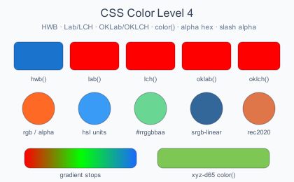
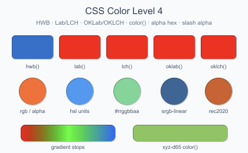
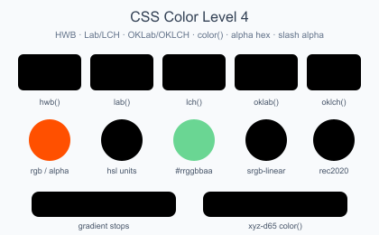

# SVG Rendering Comparison

Side-by-side rendering, file sizes, and benchmark times for 42 SVG test cases across all four libraries.

> **Note:** The **Input SVG** column is rendered live by your browser's built-in SVG engine. Use it as a reference to compare each library's PNG output against what a modern browser produces.

### 01_basic_shapes

Rectangles, circles, ellipses, and lines with solid fills and strokes.

| Input SVG | JairoSVG | EchoSVG | CairoSVG | JSVG |
| :-------: | :------: | :-----: | :------: | :--: |
|  |  |  |  |  |
| **Size** | 6,718 bytes ✅ | 8,159 bytes | 8,920 bytes | 7,031 bytes |
| **Time** | 4.3200 ms | 20.8700 ms | 5.6700 ms | **4.3100 ms** ✅ |

### 02_gradients

Linear and radial gradients with color stops and spread methods.

| Input SVG | JairoSVG | EchoSVG | CairoSVG | JSVG |
| :-------: | :------: | :-----: | :------: | :--: |
|  |  |  |  |  |
| **Size** | 25,554 bytes | 25,018 bytes | 23,637 bytes ✅ | 26,410 bytes |
| **Time** | 5.7800 ms | 169.4700 ms | 12.6600 ms | **5.7700 ms** ✅ |

### 03_complex_paths

Cubic/quadratic Bézier curves, arcs, and complex path commands.

| Input SVG | JairoSVG | EchoSVG | CairoSVG | JSVG |
| :-------: | :------: | :-----: | :------: | :--: |
|  |  |  |  |  |
| **Size** | 12,657 bytes ✅ | 16,936 bytes | 15,633 bytes | 12,730 bytes |
| **Time** | **5.4200 ms** ✅ | 29.6600 ms | 6.1100 ms | 5.4300 ms |

### 04_text_rendering

Text rendering with different fonts, sizes, weights, and tspan.

| Input SVG | JairoSVG | EchoSVG | CairoSVG | JSVG |
| :-------: | :------: | :-----: | :------: | :--: |
|  |  |  |  |  |
| **Size** | 13,276 bytes ✅ | 19,125 bytes | 16,317 bytes | 15,626 bytes |
| **Time** | **5.8900 ms** ✅ | 31.5600 ms | 9.2800 ms | 6.1200 ms |

### 05_transforms

Translate, rotate, scale, skewX, and nested group transforms.

| Input SVG | JairoSVG | EchoSVG | CairoSVG | JSVG |
| :-------: | :------: | :-----: | :------: | :--: |
|  |  |  |  |  |
| **Size** | 5,461 bytes | 5,261 bytes ✅ | 6,001 bytes | 5,827 bytes |
| **Time** | 4.9300 ms | 17.8100 ms | 5.4400 ms | **4.7500 ms** ✅ |

### 06_stroke_styles

Dash arrays, line caps (butt/round/square), and line joins.

| Input SVG | JairoSVG | EchoSVG | CairoSVG | JSVG |
| :-------: | :------: | :-----: | :------: | :--: |
|  |  |  |  |  |
| **Size** | 3,363 bytes ✅ | 5,038 bytes | 4,478 bytes | 4,074 bytes |
| **Time** | **4.4800 ms** ✅ | 15.2100 ms | 4.9400 ms | 4.4800 ms |

### 07_opacity_blend

Fill opacity, stroke opacity, and layered element opacity.

| Input SVG | JairoSVG | EchoSVG | CairoSVG | JSVG |
| :-------: | :------: | :-----: | :------: | :--: |
|  |  |  |  |  |
| **Size** | 8,409 bytes ✅ | 10,201 bytes | 9,853 bytes | 8,788 bytes |
| **Time** | 4.3000 ms | 22.5300 ms | 4.8000 ms | **4.2800 ms** ✅ |

### 08_viewbox_aspect

viewBox scaling with different preserveAspectRatio values.

| Input SVG | JairoSVG | EchoSVG | CairoSVG | JSVG |
| :-------: | :------: | :-----: | :------: | :--: |
|  |  |  |  |  |
| **Size** | 10,492 bytes ✅ | 12,769 bytes | 11,444 bytes | 12,147 bytes |
| **Time** | 6.1000 ms | 27.2400 ms | 7.7900 ms | **6.0700 ms** ✅ |

### 09_css_styling

CSS `<style>` block with class and ID selectors.

| Input SVG | JairoSVG | EchoSVG | CairoSVG | JSVG |
| :-------: | :------: | :-----: | :------: | :--: |
|  |  |  |  |  |
| **Size** | 7,755 bytes ✅ | 11,144 bytes | 10,816 bytes | 8,653 bytes |
| **Time** | **4.1900 ms** ✅ | 19.8900 ms | 6.5300 ms | 4.2500 ms |

### 10_use_and_defs

`<use>` element references, `<clipPath>`, and `<defs>` reuse.

| Input SVG | JairoSVG | EchoSVG | CairoSVG | JSVG |
| :-------: | :------: | :-----: | :------: | :--: |
|  |  |  |  |  |
| **Size** | 5,448 bytes ✅ | 6,122 bytes | 9,712 bytes | 6,144 bytes |
| **Time** | 4.8400 ms | 18.0200 ms | 6.2800 ms | **4.7000 ms** ✅ |

### 11_star_polygon

Complex star polygon with fill-rule evenodd.

| Input SVG | JairoSVG | EchoSVG | CairoSVG | JSVG |
| :-------: | :------: | :-----: | :------: | :--: |
|  |  |  |  |  |
| **Size** | 6,228 bytes ✅ | 8,862 bytes | 8,911 bytes | 6,455 bytes |
| **Time** | **4.0600 ms** ✅ | 18.5100 ms | 4.2400 ms | 4.0800 ms |

### 12_nested_svg

Nested `<svg>` elements with independent viewports.

| Input SVG | JairoSVG | EchoSVG | CairoSVG | JSVG |
| :-------: | :------: | :-----: | :------: | :--: |
|  |  |  |  |  |
| **Size** | 10,926 bytes ✅ | 12,522 bytes | 11,880 bytes | 12,101 bytes |
| **Time** | 5.7200 ms | 24.7800 ms | 7.2700 ms | **5.6900 ms** ✅ |

### 13_patterns

Tiled pattern fills: dots, cross-hatch stripes, and grid lines.

| Input SVG | JairoSVG | EchoSVG | CairoSVG | JSVG |
| :-------: | :------: | :-----: | :------: | :--: |
|  |  |  |  |  |
| **Size** | 9,532 bytes ✅ | 11,832 bytes | 11,095 bytes | 11,043 bytes |
| **Time** | 5.7300 ms | 21.2600 ms | 6.7400 ms | **5.7100 ms** ✅ |

### 14_clip_paths

Star and text clip paths applied to gradient fills.

| Input SVG | JairoSVG | EchoSVG | CairoSVG | JSVG |
| :-------: | :------: | :-----: | :------: | :--: |
|  |  |  |  |  |
| **Size** | 9,342 bytes ✅ | 10,558 bytes | 13,552 bytes | 10,253 bytes |
| **Time** | **5.2400 ms** ✅ | 36.1900 ms | 7.6800 ms | 5.3900 ms |

### 15_masks

Horizontal, vertical, and circular gradient masks with luminance blending.

| Input SVG | JairoSVG | EchoSVG | CairoSVG | JSVG |
| :-------: | :------: | :-----: | :------: | :--: |
|  |  |  |  |  |
| **Size** | 5,692 bytes | 5,566 bytes | 1,161 bytes ✅ | 6,209 bytes |
| **Time** | **5.7200 ms** ✅ | 25.3100 ms | 6.0900 ms | 5.9700 ms |

### 16_markers

Arrow, dot, and square markers on lines, polylines, and curves.

| Input SVG | JairoSVG | EchoSVG | CairoSVG | JSVG |
| :-------: | :------: | :-----: | :------: | :--: |
|  |  |  |  |  |
| **Size** | 9,796 bytes ✅ | 12,642 bytes | 12,655 bytes | 10,041 bytes |
| **Time** | 5.8800 ms | 22.8000 ms | 8.5200 ms | **5.8400 ms** ✅ |

### 17_filters

Gaussian blur and drop-shadow filters on shapes and text.

| Input SVG | JairoSVG | EchoSVG | CairoSVG | JSVG |
| :-------: | :------: | :-----: | :------: | :--: |
|  |  |  |  |  |
| **Size** | 28,934 bytes | 24,063 bytes | 8,520 bytes ✅ | 32,346 bytes |
| **Time** | 9.7900 ms | 45.3300 ms | **6.3200 ms** ✅ | 11.1900 ms |

### 18_embedded_image

Base64-encoded PNG images with clipping, transforms, and opacity.

| Input SVG | JairoSVG | EchoSVG | CairoSVG | JSVG |
| :-------: | :------: | :-----: | :------: | :--: |
|  |  |  |  |  |
| **Size** | 9,432 bytes ✅ | 11,994 bytes | 21,228 bytes | 11,642 bytes |
| **Time** | **5.8000 ms** ✅ | 22.3000 ms | 10.7900 ms | 7.7000 ms |

### 19_text_advanced

Multi-span text (tspan), text-decoration, textPath on curves, and rotated text.

| Input SVG | JairoSVG | EchoSVG | CairoSVG | JSVG |
| :-------: | :------: | :-----: | :------: | :--: |
|  |  |  |  |  |
| **Size** | 18,801 bytes ✅ | 26,256 bytes | 23,864 bytes | 19,756 bytes |
| **Time** | **6.6500 ms** ✅ | 36.7300 ms | 14.5300 ms | 7.0500 ms |

### 20_fe_blend_modes

feBlend modes: normal, multiply, screen, darken, and lighten.

| Input SVG | JairoSVG | EchoSVG | CairoSVG | JSVG |
| :-------: | :------: | :-----: | :------: | :--: |
|  |  |  |  |  |
| **Size** | 12,005 bytes ✅ | 16,216 bytes | 12,505 bytes | 15,773 bytes |
| **Time** | **13.5500 ms** ✅ | 37.7900 ms | 24.2500 ms | 28.5100 ms |

### 21_fe_tile

`feTile` filter primitive: repeating input across the filter region.

| Input SVG | JairoSVG | EchoSVG | CairoSVG | JSVG |
| :-------: | :------: | :-----: | :------: | :--: |
|  |  |  |  |  |
| **Size** | 1,456 bytes ✅ | 2,009 bytes | 1,768 bytes | 1,489 bytes |
| **Time** | 3.3100 ms | 8.4200 ms | 4.0400 ms | **3.2400 ms** ✅ |

### 22_feimage_data_uri

`feImage` with data-URI PNG source.

| Input SVG | JairoSVG | EchoSVG | CairoSVG | JSVG |
| :-------: | :------: | :-----: | :------: | :--: |
|  |  |  |  |  |
| **Size** | 2,633 bytes ✅ | 4,406 bytes | 3,206 bytes | 3,639 bytes |
| **Time** | **1.9300 ms** ✅ | 6.9100 ms | 3.0600 ms | 2.0900 ms |

### 23_feimage_inline_ref

`feImage` referencing an inline SVG element by fragment ID.

| Input SVG | JairoSVG | EchoSVG | CairoSVG | JSVG |
| :-------: | :------: | :-----: | :------: | :--: |
|  |  |  |  |  |
| **Size** | 2,702 bytes ✅ | 3,642 bytes | 4,903 bytes | 4,380 bytes |
| **Time** | **2.1400 ms** ✅ | 6.6000 ms | 3.0100 ms | 2.2400 ms |

### 24_localized_masks

Masks with localized coordinate systems and gradient fills.

| Input SVG | JairoSVG | EchoSVG | CairoSVG | JSVG |
| :-------: | :------: | :-----: | :------: | :--: |
|  |  |  |  |  |
| **Size** | 18,389 bytes | 17,868 bytes | 13,218 bytes ✅ | 20,239 bytes |
| **Time** | **19.4400 ms** ✅ | 66.3400 ms | 25.8600 ms | 19.6700 ms |

### 25_svg_fonts

Custom SVG font with glyph paths and missing-glyph fallback.

| Input SVG | JairoSVG | EchoSVG | CairoSVG | JSVG |
| :-------: | :------: | :-----: | :------: | :--: |
|  |  |  |  |  |
| **Size** | 10,331 bytes ✅ | 14,274 bytes | 15,233 bytes | 12,607 bytes |
| **Time** | **4.5700 ms** ✅ | 22.7500 ms | 6.3500 ms | 4.6500 ms |

### 26_symbol_use

Reusable `<symbol>` elements instantiated with `<use>` at different sizes and positions.

| Input SVG | JairoSVG | EchoSVG | CairoSVG | JSVG |
| :-------: | :------: | :-----: | :------: | :--: |
|  |  |  |  |  |
| **Size** | 15,665 bytes ✅ | 24,513 bytes | 21,625 bytes | 18,260 bytes |
| **Time** | **5.7800 ms** ✅ | 33.0000 ms | 15.1500 ms | 6.0200 ms |

### 27_switch_features

`<switch>` element with requiredFeatures and systemLanguage conditional rendering.

| Input SVG | JairoSVG | EchoSVG | CairoSVG | JSVG |
| :-------: | :------: | :-----: | :------: | :--: |
|  |  |  |  |  |
| **Size** | 11,535 bytes | 18,040 bytes | 14,493 bytes | 8,503 bytes ✅ |
| **Time** | 5.1400 ms | 27.4200 ms | 9.9400 ms | **4.4600 ms** ✅ |

### 28_css_variables

CSS custom properties with `var()` function and fallback values.

| Input SVG | JairoSVG | EchoSVG | CairoSVG | JSVG |
| :-------: | :------: | :-----: | :------: | :--: |
|  |  |  | — |  |
| **Size** | 11,574 bytes ✅ | 17,016 bytes | — | 12,509 bytes |
| **Time** | **5.1000 ms** ✅ | 26.3400 ms | N/A | 5.2000 ms |

### 29_current_color

`currentColor` keyword for fill, stroke, and gradient stops with nested inheritance.

| Input SVG | JairoSVG | EchoSVG | CairoSVG | JSVG |
| :-------: | :------: | :-----: | :------: | :--: |
|  |  |  |  |  |
| **Size** | 10,037 bytes ✅ | 14,642 bytes | 11,006 bytes | 13,030 bytes |
| **Time** | **4.9200 ms** ✅ | 24.4000 ms | 9.7100 ms | 5.2300 ms |

### 30_display_visibility

`display:none` vs `visibility:hidden` behavior, group suppression, and child override.

| Input SVG | JairoSVG | EchoSVG | CairoSVG | JSVG |
| :-------: | :------: | :-----: | :------: | :--: |
|  |  |  |  |  |
| **Size** | 11,009 bytes ✅ | 17,473 bytes | 13,218 bytes | 14,263 bytes |
| **Time** | **5.4200 ms** ✅ | 28.8000 ms | 12.6400 ms | 5.8700 ms |

### 31_nested_overflow

Nested `<svg>` elements with `overflow` values: hidden, scroll, visible, and auto.

| Input SVG | JairoSVG | EchoSVG | CairoSVG | JSVG |
| :-------: | :------: | :-----: | :------: | :--: |
|  |  |  |  |  |
| **Size** | 11,273 bytes ✅ | 16,322 bytes | 13,738 bytes | 13,737 bytes |
| **Time** | **5.3900 ms** ✅ | 28.6000 ms | 9.3800 ms | 5.5500 ms |

### 32_stroke_advanced

`stroke-dashoffset` phase shifting and `stroke-miterlimit` miter-to-bevel fallback.

| Input SVG | JairoSVG | EchoSVG | CairoSVG | JSVG |
| :-------: | :------: | :-----: | :------: | :--: |
|  |  |  |  |  |
| **Size** | 9,287 bytes ✅ | 14,507 bytes | 12,246 bytes | 11,702 bytes |
| **Time** | **4.7500 ms** ✅ | 25.9500 ms | 9.7900 ms | 4.9700 ms |

### 33_pattern_transforms

`patternTransform` with scale, rotate, translate, and combined transforms.

| Input SVG | JairoSVG | EchoSVG | CairoSVG | JSVG |
| :-------: | :------: | :-----: | :------: | :--: |
|  |  |  |  |  |
| **Size** | 9,052 bytes ✅ | 16,101 bytes | 13,061 bytes | 16,273 bytes |
| **Time** | **5.0000 ms** ✅ | 28.1800 ms | 10.3100 ms | 5.2400 ms |

### 34_gradient_advanced

Gradient `spreadMethod` (reflect/repeat/pad), `fx`/`fy` focus, `href` inheritance, and `userSpaceOnUse`.

| Input SVG | JairoSVG | EchoSVG | CairoSVG | JSVG |
| :-------: | :------: | :-----: | :------: | :--: |
|  |  |  |  |  |
| **Size** | 31,339 bytes | 35,647 bytes | 30,960 bytes ✅ | 35,070 bytes |
| **Time** | **8.9100 ms** ✅ | 60.5100 ms | 18.5900 ms | 9.3100 ms |

### 35_filter_merge_offset

`feMerge` for compositing layers and `feOffset` for position shifting with shadow effects.

| Input SVG | JairoSVG | EchoSVG | CairoSVG | JSVG |
| :-------: | :------: | :-----: | :------: | :--: |
|  |  |  |  |  |
| **Size** | 9,348 bytes ✅ | 14,868 bytes | 14,168 bytes | 12,184 bytes |
| **Time** | **6.9500 ms** ✅ | 25.9700 ms | 10.4600 ms | 13.3800 ms |

### 36_fe_color_matrix

`feColorMatrix` with type matrix, saturate, hueRotate, and luminanceToAlpha.

| Input SVG | JairoSVG | EchoSVG | CairoSVG | JSVG |
| :-------: | :------: | :-----: | :------: | :--: |
|  |  |  |  |  |
| **Size** | 13,131 bytes | 15,605 bytes | 10,152 bytes ✅ | 14,503 bytes |
| **Time** | **4.7100 ms** ✅ | 24.2500 ms | 9.8500 ms | 5.0800 ms |

### 37_fe_morphology

`feMorphology` erode and dilate operators on text, shapes, and circles.

| Input SVG | JairoSVG | EchoSVG | CairoSVG | JSVG |
| :-------: | :------: | :-----: | :------: | :--: |
|  |  |  |  |  |
| **Size** | 9,850 bytes | 13,914 bytes | 10,313 bytes | 9,544 bytes ✅ |
| **Time** | **5.1300 ms** ✅ | 25.7400 ms | 9.3800 ms | 7.0100 ms |

### 38_fe_turbulence

`feTurbulence` fractalNoise and turbulence types with varying frequency and octaves.

| Input SVG | JairoSVG | EchoSVG | CairoSVG | JSVG |
| :-------: | :------: | :-----: | :------: | :--: |
|  |  |  |  |  |
| **Size** | 77,590 bytes | 64,097 bytes | 9,371 bytes ✅ | 76,437 bytes |
| **Time** | 13.0200 ms | 51.3500 ms | **10.5100 ms** ✅ | 11.1800 ms |

### 39_fe_displacement_map

`feDisplacementMap` distortion using a turbulence displacement source.

| Input SVG | JairoSVG | EchoSVG | CairoSVG | JSVG |
| :-------: | :------: | :-----: | :------: | :--: |
|  |  |  |  |  |
| **Size** | 9,151 bytes ✅ | 17,633 bytes | 9,684 bytes | 10,208 bytes |
| **Time** | 7.5200 ms | 28.1800 ms | **7.1700 ms** ✅ | 16.0300 ms |

### 40_fe_lighting

`feDiffuseLighting` and `feSpecularLighting` with distant and point light sources.

| Input SVG | JairoSVG | EchoSVG | CairoSVG | JSVG |
| :-------: | :------: | :-----: | :------: | :--: |
|  |  |  |  |  |
| **Size** | 12,213 bytes | 18,277 bytes | 9,006 bytes ✅ | 10,269 bytes |
| **Time** | 6.5000 ms | 30.2800 ms | 8.3300 ms | **6.1500 ms** ✅ |

### 41_fe_convolve_matrix

`feConvolveMatrix` convolution effects: emboss, edge detection, sharpen, and box blur.

| Input SVG | JairoSVG | EchoSVG | CairoSVG | JSVG |
| :-------: | :------: | :-----: | :------: | :--: |
|  |  |  |  |  |
| **Size** | 12,104 bytes | 6,858 bytes ✅ | 9,045 bytes | 8,834 bytes |
| **Time** | **5.1400 ms** ✅ | N/A | 8.3600 ms | 11.7400 ms |

### 42_fe_component_transfer

`feComponentTransfer` with gamma, discrete, linear, and table transfer functions.

| Input SVG | JairoSVG | EchoSVG | CairoSVG | JSVG |
| :-------: | :------: | :-----: | :------: | :--: |
|  |  |  |  |  |
| **Size** | 9,118 bytes ✅ | 12,543 bytes | 9,950 bytes | 10,463 bytes |
| **Time** | **4.2300 ms** ✅ | 22.5300 ms | 10.2600 ms | 4.5500 ms |

### 43_css_color_level_4

CSS Color Level 4 syntax: HWB, Lab/LCH, OKLab/OKLCH, color(), alpha hex, and slash alpha.

| Input SVG | JairoSVG | EchoSVG | CairoSVG | JSVG |
| :-------: | :------: | :-----: | :------: | :--: |
|  |  |  | — |  |
| **Size** | 16,214 bytes | 47,602 bytes | — | 15,886 bytes ✅ |
| **Time** | — | — | — | — |

---

> **⚠️ Filters/Masks caveat:** CairoSVG supports only three SVG filter primitives (`feBlend`, `feFlood`, `feOffset`) — all others (`feGaussianBlur`, `feDropShadow`, `feTurbulence`, `feDisplacementMap`, `feLighting`, `feColorMatrix`, `feMorphology`, `feConvolveMatrix`, `feComponentTransfer`, `feComposite`, `feMerge`, `feImage`, `feTile`) are silently skipped. Masks are also rendered incorrectly (missing gradient and shape content). For those tests, CairoSVG appears faster and produces smaller files because it skips the rendering work. JairoSVG and JSVG perform the actual computation. Note: JairoSVG **outperforms CairoSVG on both Masks and feBlend modes** despite rendering them correctly. CairoSVG also **crashes** on CSS custom properties (`var()`) and CSS Color Level 4 syntax — tests 28 and 43 produce no output.

<!-- BEGIN:BENCHMARK_NOTE -->
> **Note:** Benchmarks were run with 50 warm-up iterations and 500 measured iterations per SVG file. Median time reported. Results may vary by hardware and SVG complexity.
<!-- END:BENCHMARK_NOTE -->

#### Default Rendering Settings: JairoSVG vs JSVG

Both JairoSVG and JSVG use Java2D as their rendering backend, but they ship with **different default quality settings**, which directly affects benchmark performance:

| Setting                       | JairoSVG default             | JSVG default (out-of-the-box)          | Performance impact |
| ----------------------------- | ---------------------------- | -------------------------------------- | :----------------: |
| `KEY_ANTIALIASING`            | `VALUE_ANTIALIAS_ON`         | `VALUE_ANTIALIAS_ON` (auto-set)        |        Low         |
| `KEY_TEXT_ANTIALIASING`       | Not set (platform default)   | Not set (platform default)             |        Low         |
| `KEY_RENDERING`               | Not set (defaults to speed)  | Not set (defaults to speed)            |      **High**      |
| `KEY_STROKE_CONTROL`          | `VALUE_STROKE_PURE`          | `VALUE_STROKE_PURE` (auto-set)         |       Equal        |
| `KEY_FRACTIONALMETRICS`       | Not set (defaults to `OFF`)  | Not set (defaults to `OFF`)            |       Medium       |
| **PNG compression level**     | 6 (matches CairoSVG/libpng) | N/A (no built-in PNG; user uses `ImageIO`) |       Medium       |

JSVG automatically sets `KEY_ANTIALIASING` and `KEY_STROKE_CONTROL` to the values above when they are at their defaults. JairoSVG now uses the same defaults as JSVG, so both renderers operate with identical quality settings out of the box. Users can customize any hint via `JairoSVG.builder().renderingHint(key, value)`.

**In the benchmark**, both JairoSVG and JSVG use identical rendering hints, so the comparison measures SVG engine efficiency directly.

> **⚠️ Filters/Masks:** Where CairoSVG produces much smaller output, it is because CairoSVG **does not implement** most SVG filter primitives — only `feBlend`, `feFlood`, and `feOffset` are supported; all others are silently skipped. Masks are also rendered without gradient/shape content. This results in simpler images that compress better. JairoSVG and JSVG render these effects correctly, producing visually accurate but larger PNGs.

## Running the Benchmark

Prerequisites: [JBang], Java 25+, Python 3 with CairoSVG (`pip install cairosvg`), JairoSVG installed in local Maven repo.

```bash
./mvnw install -DskipTests
jbang comparison/benchmark/benchmark.java
```

Options:

```bash
# Run specific SVG categories only
jbang comparison/benchmark/benchmark.java filters embedded

# Skip engines
jbang comparison/benchmark/benchmark.java --no-cairosvg
jbang comparison/benchmark/benchmark.java --no-echosvg
jbang comparison/benchmark/benchmark.java --no-jsvg

# Disable progress bar output (useful for CI logs)
jbang comparison/benchmark/benchmark.java --no-progress

# Adjust warmup and measurement iterations (defaults: 50 and 500)
jbang comparison/benchmark/benchmark.java --warmup=5 --iterations=100
```

The benchmark writes results to `benchmark/benchmark-results.jsonl` (JSON lines) and logs to a timestamped file. The `update_readme.java` script reads the JSONL and PNG files to regenerate both the timing table and PNG file sizes table in this document.

<!-- Link references -->

[JBang]: https://www.jbang.dev/
