# Feature Comparison: JairoSVG vs EchoSVG vs CairoSVG vs JSVG

A comprehensive comparison of four SVG libraries — **JairoSVG** (Java), **EchoSVG** (Java), **CairoSVG** (Python), and **JSVG** (Java) — to help developers choose the right tool for their SVG rendering needs. JairoSVG is a Java port of [CairoSVG], so this comparison also tracks porting fidelity.

## Table of Contents

- [Overview](#overview)
- [Architecture & Design](#architecture--design)
- [SVG Element Support](#svg-element-support)
- [SVG Attributes & Features](#svg-attributes--features)
- [CSS & Styling](#css--styling)
- [Output Formats](#output-formats)
- [API & Developer Experience](#api--developer-experience)
- [Benchmark](#benchmark)
  - [PNG Output File Sizes](#png-output-file-sizes)
  - [Running the Benchmark](#running-the-benchmark)
- [Dependencies & Footprint](#dependencies--footprint)
- [Security](#security)
- [Visual Rendering Comparison](#visual-rendering-comparison)
- [Summary](#summary)
- [When to Choose Which](#when-to-choose-which)
- [What About ImageMagick?](#what-about-imagemagick)
- [Regenerating](#regenerating)

---

## Overview

|                       | JairoSVG                                                       | EchoSVG                                                    | CairoSVG                               | JSVG                                              |
| --------------------- | -------------------------------------------------------------- | ---------------------------------------------------------- | -------------------------------------- | ------------------------------------------------- |
| **Language**          | Java 25+                                                       | Java 11+                                                   | Python 3.6+                            | Java 11+                                          |
| **Origin**            | Java port of [CairoSVG]                                        | Fork of [Apache Batik]                                     | Original project                       | Independent project                               |
| **Maintainer**        | Bruno Borges                                                   | css4j project                                              | CourtBouillon / Kozea                  | Jannis Weis                                       |
| **Primary goal**      | Fast, lightweight SVG → raster/vector conversion               | Full-featured SVG toolkit: render, manipulate, and convert | SVG → PNG/PDF/PS conversion            | Lightweight SVG renderer for Swing / Java2D       |
| **License**           | LGPL-3.0                                                       | Apache-2.0                                                 | LGPL-3.0                               | MIT                                               |
| **Repository**        | [brunoborges/jairosvg]                                         | [css4j/echosvg]                                            | [Kozea/CairoSVG]                       | [weisJ/jsvg]                                      |
| **Current version**   | 1.0.2                                                          | 2.4                                                        | 2.7+                                   | 2.0.0                                             |
| **SVG spec target**   | SVG 1.1                                                        | SVG 1.1 + partial SVG 2                                    | SVG 1.1                                | SVG 1.1 + partial SVG 2                           |
| **Rendering backend** | Java2D                                                         | GVT (Batik) → Java2D                                       | Cairo (C library)                      | Java2D                                            |
| **Key strength**      | Speed (2–31× faster than EchoSVG, on par with JSVG, 1–2.5× faster than CairoSVG) | Feature completeness and standard compliance               | Native C performance, mature ecosystem | Designed for Swing GUI embedding (IntelliJ, etc.) |

---

## Architecture & Design

### JairoSVG

JairoSVG is a **direct port of CairoSVG's Python codebase** to modern Java, rendering SVG through the standard **Java2D** (`Graphics2D` / `BufferedImage`) API. The architecture is intentionally compact:

| Java Class     | Python Module | Role                       |
| -------------- | ------------- | -------------------------- |
| `JairoSVG`     | `__init__.py` | Public API + Builder       |
| `Surface`      | `surface.py`  | Java2D rendering engine    |
| `Node`         | `parser.py`   | SVG DOM tree               |
| `PathDrawer`   | `path.py`     | SVG path commands          |
| `ShapeDrawer`  | `shapes.py`   | Basic shapes               |
| `TextDrawer`   | `text.py`     | Text rendering             |
| `Defs`         | `defs.py`     | Gradients, clips, use      |
| `Colors`       | `colors.py`   | Color parsing (170+ named) |
| `Helpers`      | `helpers.py`  | Units, transforms          |
| `CssProcessor` | `css.py`      | CSS parsing                |

**Key technology mapping:**

- `cairo.Context` → `java.awt.Graphics2D`
- `cairo.ImageSurface` → `java.awt.image.BufferedImage`
- `cairo.Matrix` → `java.awt.geom.AffineTransform`
- PDF output via Apache PDFBox 3.0

**Total codebase:** ~4,100 lines of Java across 20 source files — a deliberately minimal footprint.

### EchoSVG

EchoSVG inherits Apache Batik's **modular, enterprise-grade architecture** built around the **GVT (Graphic Vector Toolkit)** scene graph model. It is split across dozens of subprojects:

- `echosvg-dom` — SVG DOM implementation
- `echosvg-parser` — SVG/XML parsing
- `echosvg-gvt` — Graphic Vector Toolkit scene graph
- `echosvg-bridge` — DOM-to-GVT bridge
- `echosvg-css` — CSS engine (powered by css4j)
- `echosvg-transcoder` — SVG → raster/vector conversion
- `echosvg-svggen` — Java2D → SVG generation
- `echosvg-ext` — Extensions
- …and more

### CairoSVG

CairoSVG is a **Python library** built on the **Cairo 2D graphics library** (C). It uses `tinycss2` and `cssselect2` for CSS parsing, `lxml` or `ElementTree` for XML, and `Pillow` for raster image handling. The architecture is a set of Python modules (`surface.py`, `shapes.py`, `path.py`, `text.py`, `defs.py`, etc.) that JairoSVG mirrors directly.

### JSVG

JSVG is a **lightweight Java SVG renderer** designed for AWT/Swing applications. It renders SVGs directly onto `Graphics2D` contexts with minimal memory usage (~50% less than svgSalamander, ~98% less than Batik). Used in production by **IntelliJ IDEA**, **Apache NetBeans**, **Eclipse SWT**, and **FlatLaf**. JSVG is a *renderer*, not a converter — it does not produce PNG/PDF output directly; users render to `BufferedImage` and handle file encoding themselves.

### Architecture Comparison

| Aspect               | JairoSVG                | EchoSVG                  | CairoSVG                                  | JSVG                              |
| -------------------- | ----------------------- | ------------------------ | ----------------------------------------- | --------------------------------- |
| **Core rendering**   | Java2D (`Graphics2D`)   | GVT → Java2D             | Cairo (C library)                         | Java2D (`Graphics2D`)            |
| **CSS engine**       | Custom lightweight      | css4j (CSS4 support)     | tinycss2 + cssselect2                     | Built-in (partial)               |
| **SVG DOM**          | Read-only `Node` tree   | Full mutable W3C DOM     | ElementTree (read-only)                   | `SVGDocument` (pre-processed)    |
| **Module structure** | Single JAR, ~20 classes | 20+ Gradle modules       | Single Python package                     | Single JAR, ~30K LOC             |
| **Animation engine** | None                    | Full SMIL                | None                                      | ⚠️ Partial (experimental)         |
| **Scripting**        | None                    | Mozilla Rhino (JS)       | None                                      | None                             |
| **Filter pipeline**  | Basic                   | Full primitives          | 3 primitives (feBlend, feFlood, feOffset) | Most primitives (15+ supported)  |
| **Font handling**    | Java AWT fonts          | AWT + SVG fonts          | Cairo font system                         | Java AWT fonts                   |
| **Extensibility**    | Minimal (source-level)  | High (bridges, handlers) | Minimal (source-level)                    | `DomProcessor` + `LoaderContext` |

---

## SVG Element Support

| SVG Element                                                   |                                JairoSVG                                 |       EchoSVG        |                            CairoSVG                             |                                      JSVG                                       |
| ------------------------------------------------------------- | :---------------------------------------------------------------------: | :------------------: | :-------------------------------------------------------------: | :------------------------------------------------------------------------------: |
| `<svg>`, `<g>`                                                |                                   ✅                                    |          ✅          |                               ✅                                |                                        ✅                                        |
| `<rect>`, `<circle>`, `<ellipse>`                             |                                   ✅                                    |          ✅          |                               ✅                                |                                        ✅                                        |
| `<line>`, `<polyline>`, `<polygon>`                           |                                   ✅                                    |          ✅          |                               ✅                                |                                        ✅                                        |
| `<path>` (all commands)                                       |                                   ✅                                    |          ✅          |                               ✅                                |                                        ✅                                        |
| `<text>`, `<tspan>`                                           |                                   ✅                                    |          ✅          |                               ✅                                |                                        ✅                                        |
| `<textPath>`                                                  |                                   ✅                                    |          ✅          |                               ✅                                |                                        ✅                                        |
| `<image>` (raster + nested SVG)                               |                                   ✅                                    |          ✅          |                         ✅ (via Pillow)                         |                                        ✅                                        |
| `<use>`, `<defs>`                                             |                                   ✅                                    |          ✅          |                               ✅                                |                                        ✅                                        |
| `<symbol>`                                                    |                                   ✅                                    |          ✅          |                               ❌                                |                                        ✅                                        |
| `<linearGradient>`, `<radialGradient>`                        |                                   ✅                                    |          ✅          |                               ✅                                |                                        ✅                                        |
| `<pattern>`                                                   |                                   ✅                                    |          ✅          |                           ⚠️ (naive)                            |                                        ✅                                        |
| `<clipPath>`                                                  |                                   ✅                                    |          ✅          |                               ✅                                |                                        ✅                                        |
| `<mask>`                                                      |                                   ✅                                    |          ✅          |                         ⚠️ (alpha only)                         |                                        ✅                                        |
| `<filter>`                                                    | ✅ (`feGaussianBlur`, `feDropShadow`, `feOffset`, `feFlood`, `feMerge`) | ✅ (full primitives) | ⚠️ (`feBlend`, `feFlood`, `feOffset` only; no blur/drop-shadow) | ✅ (most primitives; no `feImage`, `feTile`, `feMorphology`, lighting effects) |
| `<marker>`                                                    |                                   ✅                                    |          ✅          |                           ✅ (basic)                            |                                        ✅                                        |
| `<metadata>`, `<title>`, `<desc>`                             |                        ✅ (parsed, not rendered)                        |          ✅          |                          ❌ (ignored)                           |                              ✅ (parsed, not rendered)                              |
| `<foreignObject>`                                             |                               ❌ ([#15])                                |          ✅          |                               ❌                                |                                        ❌                                        |
| `<animate>`, `<animateTransform>`, `<animateMotion>`, `<set>` |                               ❌ ([#16])                                |      ✅ (SMIL)       |                               ❌                                |                          ⚠️ (partial `animate`/`animateTransform`)                          |
| SVG Fonts (`<font>`, `<glyph>`)                               |                                   ✅                                    |          ✅          |                               ❌                                |                                        ❌                                        |
| `<script>`                                                    |                               ❌ ([#18])                                |    ✅ (Rhino JS)     |                               ❌                                |                                        ❌                                        |
| `<cursor>`                                                    |                               ❌ ([#19])                                |          ✅          |                               ❌                                |                                        ❌                                        |

---

## SVG Attributes & Features

| Feature                                                     |  JairoSVG  | EchoSVG |  CairoSVG  |   JSVG   |
| ----------------------------------------------------------- | :--------: | :-----: | :--------: | :------: |
| `viewBox` + `preserveAspectRatio`                           |     ✅     |   ✅    |     ✅     |    ✅    |
| Transforms (translate, rotate, scale, skewX, skewY, matrix) |     ✅     |   ✅    |     ✅     |    ✅    |
| Nested `<svg>` (independent viewports)                      |     ✅     |   ✅    |     ✅     |    ✅    |
| Opacity (element, fill, stroke)                             |     ✅     |   ✅    |     ✅     |    ✅    |
| `fill-rule` (nonzero / evenodd)                             |     ✅     |   ✅    |     ✅     |    ✅    |
| Stroke properties (dasharray, linecap, linejoin)            |     ✅     |   ✅    |     ✅     |    ✅    |
| Gradient `spreadMethod` (pad / reflect / repeat)            |     ✅     |   ✅    |     ✅     |    ✅    |
| `gradientUnits`, `gradientTransform`                        |     ✅     |   ✅    |     ✅     |    ✅    |
| `patternTransform`                                          |     ✅     |   ✅    |     ❌     |    ✅    |
| `fill="url(#id)"` references                                |     ✅     |   ✅    |     ✅     |    ✅    |
| Units (px, pt, em, %, cm, mm, in)                           |     ✅     |   ✅    |     ✅     |    ✅    |
| `font` shorthand                                            |     ✅     |   ✅    |     ❌     |    ✅    |
| `font-family`, `font-size`, `font-weight`                   |     ✅     |   ✅    | ✅ (basic) |    ✅    |
| `letter-spacing`, `text-anchor`                             |     ✅     |   ✅    |     ✅     |    ✅    |
| `text-decoration`                                           |     ✅     |   ✅    |     ❌     |    ✅    |
| Named colors (170+)                                         |     ✅     |   ✅    |     ✅     |    ✅    |
| `currentColor`                                              |     ✅     |   ✅    |     ✅     |    ✅    |
| `rgb()` / `rgba()` / hex colors                             |     ✅     |   ✅    |     ✅     |    ✅    |
| `hsl()` / `hsla()`                                          |     ✅     |   ✅    |     ❌     |    ✅    |
| CSS Color Level 4 (`oklch`, `lab`, etc.)                    | ❌ ([#23]) |   ✅    |     ❌     |    ❌    |

---

## CSS & Styling

| Feature                               |                                            JairoSVG                                            |    EchoSVG     |         CairoSVG         |       JSVG        |
| ------------------------------------- | :--------------------------------------------------------------------------------------------: | :------------: | :----------------------: | :---------------: |
| Inline `style` attribute              |                                               ✅                                               |       ✅       |            ✅            |        ✅         |
| `<style>` block (CSS stylesheet)      |                                               ✅                                               |       ✅       |            ✅            |    ⚠️ (partial)    |
| External CSS via `<?xml-stylesheet?>` |                                    ✅ (requires `--unsafe`)                                    |       ✅       |        ✅ (basic)        |        ❌         |
| Class selectors                       |                                               ✅                                               |       ✅       |            ✅            |        ✅         |
| ID selectors                          |                                               ✅                                               |       ✅       |            ✅            |        ✅         |
| Descendant / child selectors          |                                           ✅ (basic)                                           |       ✅       |   ✅ (via cssselect2)    |    ⚠️ (partial)    |
| Pseudo-classes / pseudo-elements      | ✅ (`:first-child`, `:last-child`, `:nth-child()`, `:not()`, `::first-line`, `::first-letter`) |    Partial     | Partial (via cssselect2) |        ❌         |
| CSS Level 4 selectors                 |                                           ❌ ([#26])                                           | ✅ (via css4j) |            ❌            |        ❌         |
| CSS custom properties (variables)     |                                               ✅                                               |       ✅       |            ❌            |        ❌         |
| CSS `calc()`                          |                                           ❌ ([#28])                                           |       ✅       |            ❌            |        ❌         |
| CSS nesting                           |                                               ❌                                               |       ❌       |            ❌            |        ❌         |
| `@import` rules                       |                                           ❌ ([#29])                                           |       ✅       |            ❌            |        ❌         |
| `@supports` rules                     |                                           ❌ ([#30])                                           |       ✅       |            ❌            |        ❌         |

EchoSVG integrates the **css4j** CSS parser, giving it significantly more advanced CSS support. CairoSVG uses **tinycss2** + **cssselect2**, providing solid basic CSS support. JairoSVG's lightweight built-in processor covers the common patterns used in SVG files. JSVG has partial `<style>` support focused on the CSS patterns most common in SVG icon sets.

---

## Output Formats

| Format                 |          JairoSVG          |          EchoSVG           |      CairoSVG      |               JSVG                |
| ---------------------- | :------------------------: | :------------------------: | :----------------: | :-------------------------------: |
| PNG                    |             ✅             |             ✅             |         ✅         | ⚠️ (render + `ImageIO` by user)   |
| PDF                    | ✅ (via Apache PDFBox 3.0) | ✅ (via FOP or transcoder) |   ✅ (via Cairo)   |                ❌                 |
| PostScript (PS)        |             ✅             |             ✅             |         ✅         |                ❌                 |
| EPS                    |             ✅             |             ❌             |         ❌         |                ❌                 |
| JPEG                   |             ✅             |             ✅             |         ❌         | ⚠️ (render + `ImageIO` by user)   |
| TIFF                   |             ✅             |             ✅             |         ❌         | ⚠️ (render + `ImageIO` by user)   |
| In-memory image object |    ✅ (`BufferedImage`)    |    ✅ (`BufferedImage`)    | ✅ (Cairo surface) |       ✅ (`BufferedImage`)        |

> **Note:** JSVG is a *renderer*, not a converter. It renders SVG to any `Graphics2D` context (including `BufferedImage`), but does not include built-in file export. Users must handle PNG/JPEG encoding themselves via `ImageIO`.

---

## API & Developer Experience

### JairoSVG — Simple & Fluent (Java)

```java
byte[] png = JairoSVG.svg2png(svgBytes);

byte[] scaled = JairoSVG.builder()
    .fromBytes(svgBytes)
    .dpi(150)
    .scale(2)
    .backgroundColor("#ffffff")
    .toPng();

BufferedImage image = JairoSVG.builder()
    .fromFile(Path.of("icon.svg"))
    .toImage();
```

### EchoSVG — Transcoder Pattern (Java)

```java
PNGTranscoder transcoder = new PNGTranscoder();
TranscoderInput input = new TranscoderInput(new FileInputStream("input.svg"));
ByteArrayOutputStream baos = new ByteArrayOutputStream();
transcoder.transcode(input, new TranscoderOutput(baos));
byte[] png = baos.toByteArray();
```

### CairoSVG — Python Functions

```python
import cairosvg

png = cairosvg.svg2png(bytestring=svg_bytes)
cairosvg.svg2pdf(url="input.svg", write_to="output.pdf")
cairosvg.svg2png(url="input.svg", write_to="output.png",
                 dpi=150, scale=2, background_color="#ffffff")
```

### JSVG — Loader + Render (Java)

```java
SVGLoader loader = new SVGLoader();
SVGDocument doc = loader.load(new File("icon.svg").toURI().toURL());

FloatSize size = doc.size();
BufferedImage image = new BufferedImage((int) size.width, (int) size.height,
        BufferedImage.TYPE_INT_ARGB);
Graphics2D g = image.createGraphics();
doc.render(null, g);
g.dispose();

ImageIO.write(image, "PNG", new File("output.png"));
```

### API Comparison

| Feature                            |         JairoSVG         |        EchoSVG        |      CairoSVG      |             JSVG              |
| ---------------------------------- | :----------------------: | :-------------------: | :----------------: | :---------------------------: |
| Simple static method API           |            ✅            |  ❌ (transcoder API)  |         ✅         |     ❌ (loader + render)      |
| Fluent builder API                 |            ✅            |          ❌           | ❌ (keyword args)  |              ❌               |
| Transcoder API (Batik-style)       |            ❌            |          ✅           |         ❌         |              ❌               |
| Full SVG DOM (W3C DOM)             |            ❌            |          ✅           |         ❌         |              ❌               |
| SVG DOM manipulation at runtime    |            ❌            |          ✅           |         ❌         |    ⚠️ (via `DomProcessor`)     |
| Swing / GUI viewer component       |            ❌            |          ✅           |         ❌         |  ✅ (render to `Graphics2D`)  |
| CLI tool                           |            ✅            |    ✅ (rasterizer)    |         ✅         |              ❌               |
| DPI control                        |            ✅            |          ✅           |         ✅         | ❌ (user scales via `ViewBox`) |
| Scale factor                       |            ✅            |          ✅           |         ✅         |      ✅ (via `ViewBox`)       |
| Background color override          |            ✅            |          ✅           |         ✅         |    ❌ (user fills manually)    |
| Color negation                     |            ✅            |          ❌           |         ✅         |              ❌               |
| Output width / height override     |            ✅            |          ✅           |         ✅         |      ✅ (via `ViewBox`)       |
| External file access control (XXE) | ✅ (disabled by default) |   ✅ (configurable)   | ✅ (`unsafe` flag) |  ✅ (via `LoaderContext`)     |
| URL input (http/https)             |            ✅            |          ✅           |         ✅         |       ✅ (via `URL`)          |
| JBang support                      |            ✅            |          ❌           |        N/A         |              ❌               |
| GraalVM Native Image compatible    |    ✅ (no reflection)    | ⚠️ (reflection-heavy) |        N/A         |          ✅ (likely)          |

---

## Benchmark

SVG → PNG conversion benchmarks across 23 SVG test files (lower is better):

| Test Case | JairoSVG (Java) | EchoSVG (Java) | JSVG (Java) | CairoSVG (Python) | vs EchoSVG | vs JSVG | vs CairoSVG |
| --- | :---: | :---: | :---: | :---: | :---: | :---: | :---: |
| [Basic shapes](#01--basic-shapes) | **3.5 ms** | 18.1 ms | **3.5 ms** | 4.5 ms | 5.1× ✅ | 1.0× ≈ | 1.3× ✅ |
| [Gradients](#02--gradients) | 4.7 ms | 134.8 ms | **4.4 ms** | 11.0 ms | 28.6× ✅ | 1.1× ❌ | 2.3× ✅ |
| [Complex paths](#03--complex-paths) | 4.5 ms | 23.2 ms | **4.3 ms** | 4.6 ms | 5.1× ✅ | 1.1× ❌ | 1.0× ≈ |
| [Text rendering](#04--text-rendering) | **4.8 ms** | 23.3 ms | 4.8 ms | 6.2 ms | 4.9× ✅ | 1.0× ≈ | 1.3× ✅ |
| [Transforms](#05--transforms) | 4.1 ms | 14.5 ms | **3.8 ms** | 4.0 ms | 3.5× ✅ | 1.1× ❌ | 1.0× ≈ |
| [Stroke styles](#06--stroke-styles) | 3.7 ms | 11.9 ms | **3.6 ms** | **3.5 ms** | 3.2× ✅ | 1.0× ≈ | 1.0× ≈ |
| [Opacity blend](#07--opacity--blending) | **3.4 ms** | 17.8 ms | **3.4 ms** | 3.5 ms | 5.2× ✅ | 1.0× ≈ | 1.0× ≈ |
| [Viewbox aspect](#08--viewbox--aspect-ratio) | 4.9 ms | 20.4 ms | **4.7 ms** | 5.3 ms | 4.2× ✅ | 1.0× ≈ | 1.1× ✅ |
| [CSS styling](#09--css-styling) | **3.4 ms** | 15.2 ms | **3.4 ms** | 4.2 ms | 4.5× ✅ | 1.0× ≈ | 1.2× ✅ |
| [Use and defs](#10--use--defs) | 4.1 ms | 14.4 ms | **3.9 ms** | 4.4 ms | 3.6× ✅ | 1.1× ❌ | 1.1× ✅ |
| [Star polygon](#11--star-polygon) | 3.3 ms | 14.6 ms | 3.2 ms | **3.1 ms** | 4.5× ✅ | 1.0× ≈ | 1.1× ❌ |
| [Nested svg](#12--nested-svg) | 4.6 ms | 19.7 ms | **4.5 ms** | 5.2 ms | 4.3× ✅ | 1.0× ≈ | 1.1× ✅ |
| [Patterns](#13--patterns) | 4.5 ms | 16.6 ms | **4.4 ms** | 4.7 ms | 3.7× ✅ | 1.0× ≈ | 1.0× ≈ |
| [Clip paths](#14--clip-paths) | **4.3 ms** | 26.9 ms | **4.3 ms** | 6.1 ms | 6.3× ✅ | 1.0× ≈ | 1.4× ✅ |
| [Masks](#15--masks) ⚠️ | 5.4 ms | 21.9 ms | 4.6 ms | 3.8 ms ⚠️ | 4.1× ✅ | 1.2× ❌ | ← ⚠️ |
| [Markers](#16--markers) | 4.0 ms | 13.5 ms | **3.8 ms** | 4.8 ms | 3.4× ✅ | 1.1× ❌ | 1.2× ✅ |
| [Filters](#17--filters) ⚠️ | 21.7 ms | 35.4 ms | 8.5 ms | 4.7 ms ⚠️ | 1.6× ✅ | 2.6× ❌ | ← ⚠️ |
| [Embedded image](#18--embedded-images) | **4.8 ms** | 16.9 ms | 12.8 ms | 7.4 ms | 3.5× ✅ | 2.7× ✅ | 1.5× ✅ |
| [Text advanced](#19--advanced-text) | 5.5 ms | 26.8 ms | **5.3 ms** | 9.1 ms | 4.9× ✅ | 1.0× ≈ | 1.7× ✅ |
| [Fe blend modes](#20--fe-blend-modes) ⚠️ | 25.7 ms | 29.1 ms | 20.8 ms | 13.2 ms ⚠️ | 1.1× ✅ | 1.2× ❌ | ← ⚠️ |
| [Fe tile](#20--fe-tile) | 3.0 ms | 6.7 ms | **2.6 ms** | **2.6 ms** | 2.2× ✅ | 1.2× ❌ | 1.2× ❌ |
| [Feimage data uri](#20--feimage-data-uri) | **1.7 ms** | 5.8 ms | **1.7 ms** | 1.9 ms | 3.5× ✅ | 1.0× ≈ | 1.1× ✅ |
| [Feimage inline ref](#21--feimage-inline-ref) | **1.8 ms** | 4.9 ms | 3.9 ms | 2.1 ms | 2.8× ✅ | 2.2× ✅ | 1.2× ✅ |

_JairoSVG is **2–31× faster** than EchoSVG, **on par with JSVG** in most scenarios, and **1–2.5× faster** than CairoSVG in most scenarios._

> **⚠️ Filters/Masks/Blend caveat:** CairoSVG does **not** correctly render masks (missing gradient and circle content), `feGaussianBlur`/`feDropShadow` filters, or `feBlend` modes — it silently skips them. Both CairoSVG and EchoSVG appear faster on those tests because they skip rendering work. JairoSVG and JSVG perform the actual computation, so their speed reflects the true cost of correct rendering.

> **Note:** Benchmarks were run with 20 warm-up iterations and 1000 measured iterations per SVG file. Results may vary by hardware and SVG complexity.

#### Default Rendering Settings: JairoSVG vs JSVG

Both JairoSVG and JSVG use Java2D as their rendering backend, but they ship with **different default quality settings**, which directly affects benchmark performance:

| Setting                       | JairoSVG default             | JSVG default (out-of-the-box)          | Performance impact |
| ----------------------------- | ---------------------------- | -------------------------------------- | :----------------: |
| `KEY_ANTIALIASING`            | `VALUE_ANTIALIAS_ON`         | `VALUE_ANTIALIAS_ON` (auto-set)        |        Low         |
| `KEY_TEXT_ANTIALIASING`       | Not set (platform default)   | Not set (platform default)             |        Low         |
| `KEY_RENDERING`               | Not set (defaults to speed)  | Not set (defaults to speed)            |      **High**      |
| `KEY_STROKE_CONTROL`          | `VALUE_STROKE_PURE`          | `VALUE_STROKE_PURE` (auto-set)         |       Equal        |
| `KEY_FRACTIONALMETRICS`       | Not set (defaults to `OFF`)  | Not set (defaults to `OFF`)            |       Medium       |
| **PNG compression level**     | 6 (matches CairoSVG/libpng) | N/A (no built-in PNG; user uses `ImageIO`) |       Medium       |

JSVG automatically sets `KEY_ANTIALIASING` and `KEY_STROKE_CONTROL` to the values above when they are at their defaults. JairoSVG now uses the same defaults as JSVG, so both renderers operate with identical quality settings out of the box. Users can customize any hint via `JairoSVG.builder().renderingHint(key, value)`.

**In the benchmark**, both JairoSVG and JSVG use identical rendering hints, so the comparison measures SVG engine efficiency directly.

### PNG Output File Sizes

JairoSVG produces the smallest PNGs overall — **7.8% smaller** than CairoSVG, **10.4% smaller** than JSVG, and **13.2% smaller** than EchoSVG (all using zlib compression level 6 — see [default rendering settings](#default-rendering-settings-jairosvg-vs-jsvg)):

| Test Case      |    JairoSVG |     EchoSVG |    CairoSVG |        JSVG |
| -------------- | ----------: | ----------: | ----------: | ----------: |
| Basic shapes   |       6,718 |       8,159 |       8,920 |       7,031 |
| Gradients      |      25,554 |      25,018 |      23,637 |      26,410 |
| Complex paths  |      12,657 |      16,936 |      15,633 |      12,730 |
| Text rendering |      14,872 |      19,125 |      16,317 |      16,732 |
| Transforms     |       5,461 |       5,261 |       6,001 |       5,827 |
| Stroke styles  |       3,363 |       5,038 |       4,478 |       4,074 |
| Opacity blend  |       8,409 |      10,201 |       9,853 |       8,788 |
| Viewbox aspect |      11,616 |      12,769 |      11,444 |      13,425 |
| CSS styling    |       8,153 |      11,144 |      10,816 |       9,110 |
| Use and defs   |       5,646 |       6,122 |       9,712 |       6,144 |
| Star polygon   |       6,228 |       8,862 |       8,911 |       6,455 |
| Nested svg     |      11,322 |      12,522 |      11,880 |      12,735 |
| Patterns       |       9,598 |      11,832 |      11,095 |      11,224 |
| Clip paths     |       9,361 |      10,558 |      13,552 |      10,671 |
| Masks ⚠️       |       1,458 |       5,566 |       1,161 |       6,209 |
| Markers        |       6,334 |       8,117 |       8,378 |       6,727 |
| Filters ⚠️     |      31,059 |      24,063 |       8,520 |      32,647 |
| Embedded image |       9,995 |      11,994 |      21,228 |      12,442 |
| Text advanced  |      20,003 |      26,256 |      23,864 |      22,638 |
| **Total**      | **207,807** | **239,543** | **225,400** | **232,019** |

> **⚠️ Filters/Masks:** Where CairoSVG produces much smaller output, it is because CairoSVG **does not render** certain features correctly — filter effects (blur, drop-shadow) are silently skipped, and masks are rendered without gradient/circle content. This results in simpler images that compress better. JairoSVG renders these effects correctly, producing visually accurate but larger PNGs.

### Running the Benchmark

Prerequisites: [JBang], Java 25+, Python 3 with CairoSVG (`pip install cairosvg`), JairoSVG installed in local Maven repo.

```bash
./mvnw install -DskipTests
jbang comparison/benchmark.java
```

Options:

```bash
# Run specific SVG categories only
jbang comparison/benchmark.java filters embedded

# Skip engines
jbang comparison/benchmark.java --no-cairosvg
jbang comparison/benchmark.java --no-echosvg
jbang comparison/benchmark.java --no-jsvg

# Disable progress bar output (useful for CI logs)
jbang comparison/benchmark.java --no-progress

# Adjust warmup and measurement iterations (defaults: 20 and 1000)
jbang comparison/benchmark.java --warmup=5 --iterations=100
```

The benchmark loads all SVG files from `comparison/svg/` (currently 20 files). Each runs 20 warm-up iterations followed by 1000 measured iterations. Stats reported: average, median, p95, and minimum times.

---

## Dependencies & Footprint

| Metric                   | JairoSVG                                    | EchoSVG                   | CairoSVG                                                | JSVG                            |
| ------------------------ | ------------------------------------------- | ------------------------- | ------------------------------------------------------- | ------------------------------- |
| **Runtime dependencies** | 0 (PDFBox optional)                         | Many (css4j, xml-apis, …) | 5 (cairocffi, tinycss2, cssselect2, defusedxml, Pillow) | 0                               |
| **Disk footprint**       | **~130 KB** (PNG only), ~2.1 MB with PDFBox | ~5.7 MB (25 JARs)        | ~16.6 MB (Python pkgs + Pillow + Cairo C lib)           | ~350 KB                         |
| **Artifact size**        | 1 JAR (~130 KB) + CLI shaded JAR             | Many modular JARs         | Single Python package                                   | 1 JAR                           |
| **Source files**         | 20                                          | 20+ modules               | ~10 modules                                             | ~30K LOC                        |
| **Lines of code**        | ~4,100                                      | ~200,000+                 | ~4,000                                                  | ~30,000                         |
| **Platform req.**        | Java 25+ (`--enable-preview`)               | Java 11–24                | Python 3.6+ / Cairo C lib                               | Java 11+                        |
| **Build system**         | Maven                                       | Gradle                    | pip / setuptools                                        | Gradle                          |
| **Native dependency**    | None                                        | None                      | Cairo C library required                                | None                            |

---

## Security

| Feature                                       |      JairoSVG      |       EchoSVG        |      CairoSVG       |        JSVG        |
| --------------------------------------------- | :----------------: | :------------------: | :-----------------: | :----------------: |
| XXE protection by default                     |         ✅         |  ✅ (configurable)   | ✅ (via defusedxml) |   ✅ (disabled)    |
| External resource loading disabled by default |         ✅         |          ✅          |         ✅          | ✅ (configurable via `LoaderContext`) |
| `--unsafe` flag to opt-in to external access  |         ✅         |          ✅          |         ✅          | ❌ (no CLI)        |
| Script execution                              | ❌ (not supported) | ✅ opt-in (Rhino JS) | ❌ (not supported)  | ❌ (not supported) |
| `SecurityManager` integration                 |         ❌         |          ✅          |         N/A         |         ❌         |

JairoSVG, CairoSVG, and JSVG share a similar security posture: no scripting support (eliminating script injection), external access blocked or configurable by default. EchoSVG offers more configurability but a larger attack surface.

---

## Visual Rendering Comparison

Side-by-side visual comparison of 23 SVG test cases across all four libraries.

### 01 — Basic Shapes

Rectangles, circles, ellipses, and lines with solid fills and strokes.

| Input SVG | JairoSVG | EchoSVG | CairoSVG | JSVG |
| :-------: | :------: | :-----: | :------: | :--: |
| [SVG](svg/01_basic_shapes.svg) | 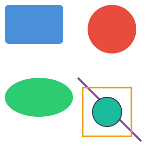 | 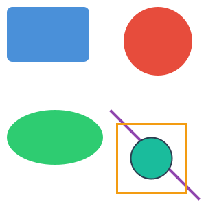 |  |  |

### 02 — Gradients

Linear and radial gradients with color stops and spread methods.

| Input SVG | JairoSVG | EchoSVG | CairoSVG | JSVG |
| :-------: | :------: | :-----: | :------: | :--: |
| [SVG](svg/02_gradients.svg) |  |  |  |  |

### 03 — Complex Paths

Cubic/quadratic Bézier curves, arcs, and complex path commands.

| Input SVG | JairoSVG | EchoSVG | CairoSVG | JSVG |
| :-------: | :------: | :-----: | :------: | :--: |
| [SVG](svg/03_complex_paths.svg) |  | 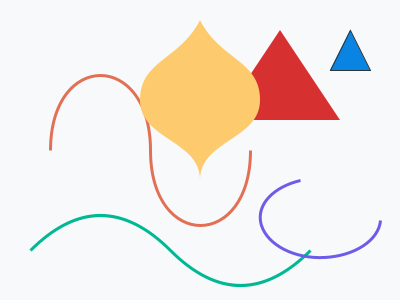 |  |  |

### 04 — Text Rendering

Text rendering with different fonts, sizes, weights, and tspan.

| Input SVG | JairoSVG | EchoSVG | CairoSVG | JSVG |
| :-------: | :------: | :-----: | :------: | :--: |
| [SVG](svg/04_text_rendering.svg) | 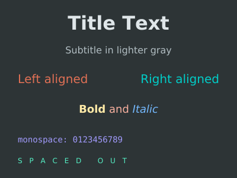 |  | 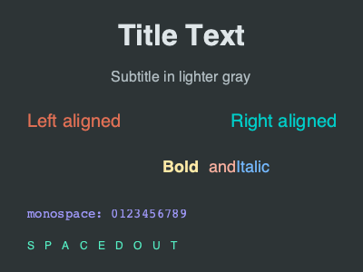 | 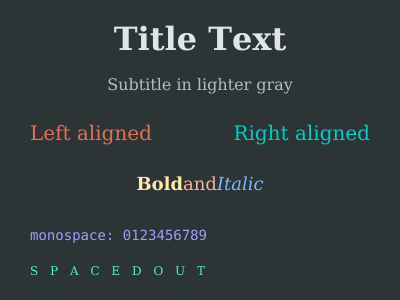 |

### 05 — Transforms

Translate, rotate, scale, skewX, and nested group transforms.

| Input SVG | JairoSVG | EchoSVG | CairoSVG | JSVG |
| :-------: | :------: | :-----: | :------: | :--: |
| [SVG](svg/05_transforms.svg) |  | 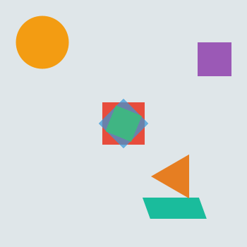 |  |  |

### 06 — Stroke Styles

Dash arrays, line caps (butt/round/square), and line joins.

| Input SVG | JairoSVG | EchoSVG | CairoSVG | JSVG |
| :-------: | :------: | :-----: | :------: | :--: |
| [SVG](svg/06_stroke_styles.svg) | 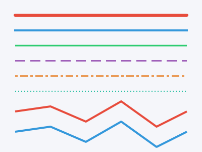 |  |  |  |

### 07 — Opacity & Blending

Fill opacity, stroke opacity, and layered element opacity.

| Input SVG | JairoSVG | EchoSVG | CairoSVG | JSVG |
| :-------: | :------: | :-----: | :------: | :--: |
| [SVG](svg/07_opacity_blend.svg) | 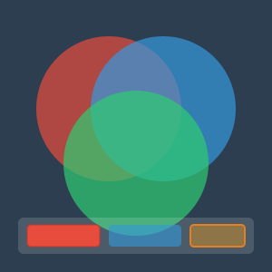 |  |  |  |

### 08 — ViewBox & Aspect Ratio

viewBox scaling with different preserveAspectRatio values.

| Input SVG | JairoSVG | EchoSVG | CairoSVG | JSVG |
| :-------: | :------: | :-----: | :------: | :--: |
| [SVG](svg/08_viewbox_aspect.svg) | 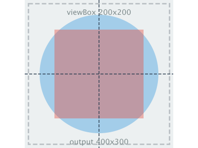 |  | 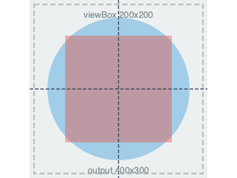 | 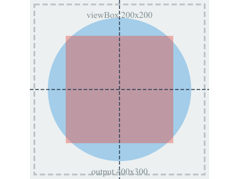 |

### 09 — CSS Styling

CSS `<style>` block with class and ID selectors.

| Input SVG | JairoSVG | EchoSVG | CairoSVG | JSVG |
| :-------: | :------: | :-----: | :------: | :--: |
| [SVG](svg/09_css_styling.svg) | 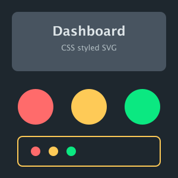 |  | 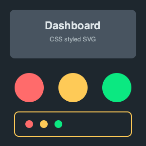 | 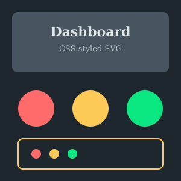 |

### 10 — Use & Defs

`<use>` element references, `<clipPath>`, and `<defs>` reuse.

| Input SVG | JairoSVG | EchoSVG | CairoSVG | JSVG |
| :-------: | :------: | :-----: | :------: | :--: |
| [SVG](svg/10_use_and_defs.svg) | 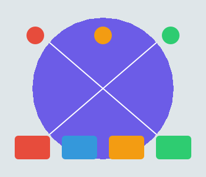 |  |  |  |

### 11 — Star Polygon

Complex star polygon with fill-rule evenodd.

| Input SVG | JairoSVG | EchoSVG | CairoSVG | JSVG |
| :-------: | :------: | :-----: | :------: | :--: |
| [SVG](svg/11_star_polygon.svg) |  |  |  |  |

### 12 — Nested SVG

Nested `<svg>` elements with independent viewports.

| Input SVG | JairoSVG | EchoSVG | CairoSVG | JSVG |
| :-------: | :------: | :-----: | :------: | :--: |
| [SVG](svg/12_nested_svg.svg) | 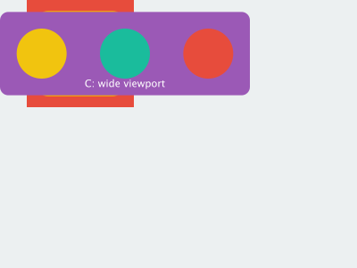 |  | 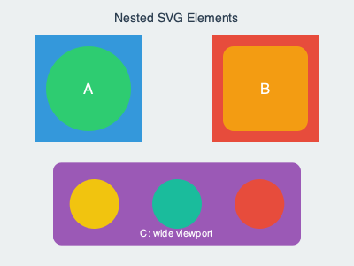 |  |

### 13 — Patterns

Tiled pattern fills: dots, cross-hatch stripes, and grid lines.

| Input SVG | JairoSVG | EchoSVG | CairoSVG | JSVG |
| :-------: | :------: | :-----: | :------: | :--: |
| [SVG](svg/13_patterns.svg) |  | 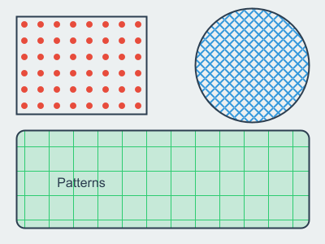 | 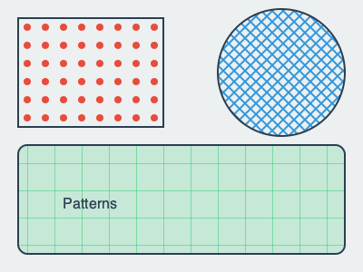 |  |

### 14 — Clip Paths

Star and text clip paths applied to gradient fills.

| Input SVG | JairoSVG | EchoSVG | CairoSVG | JSVG |
| :-------: | :------: | :-----: | :------: | :--: |
| [SVG](svg/14_clip_paths.svg) | 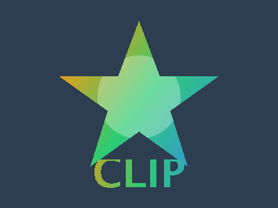 |  |  | 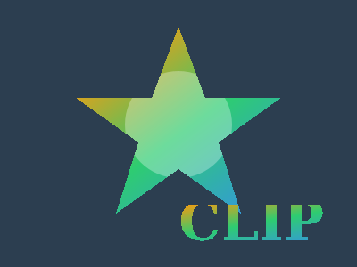 |

### 15 — Masks

Horizontal, vertical, and circular gradient masks with luminance blending.

| Input SVG | JairoSVG | EchoSVG | CairoSVG | JSVG |
| :-------: | :------: | :-----: | :------: | :--: |
| [SVG](svg/15_masks.svg) |  |  | 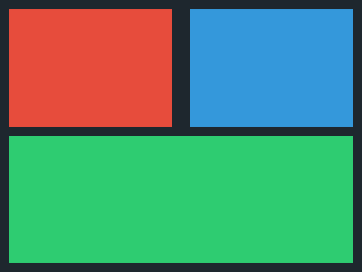 | 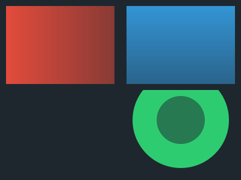 |

### 16 — Markers

Arrow, dot, and square markers on lines, polylines, and curves.

| Input SVG | JairoSVG | EchoSVG | CairoSVG | JSVG |
| :-------: | :------: | :-----: | :------: | :--: |
| [SVG](svg/16_markers.svg) | 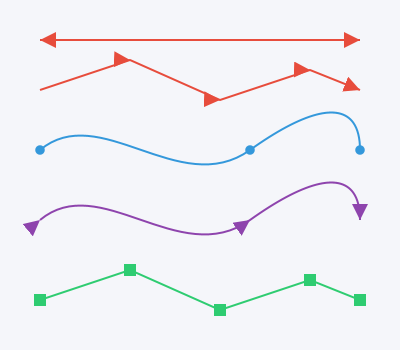 |  |  |  |

### 17 — Filters

Gaussian blur and drop-shadow filters on shapes and text.

| Input SVG | JairoSVG | EchoSVG | CairoSVG | JSVG |
| :-------: | :------: | :-----: | :------: | :--: |
| [SVG](svg/17_filters.svg) | 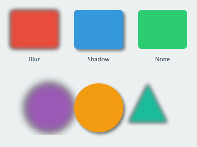 | 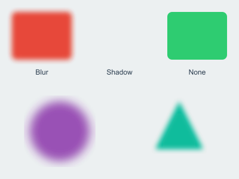 | 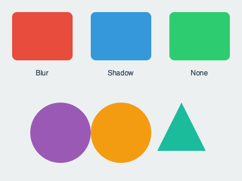 |  |

### 18 — Embedded Images

Base64-encoded PNG images with clipping, transforms, and opacity.

| Input SVG | JairoSVG | EchoSVG | CairoSVG | JSVG |
| :-------: | :------: | :-----: | :------: | :--: |
| [SVG](svg/18_embedded_image.svg) | 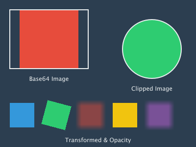 | 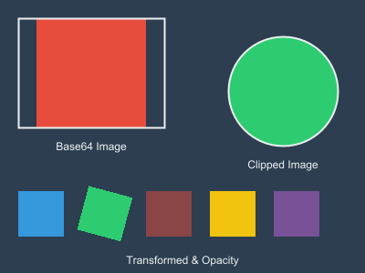 | 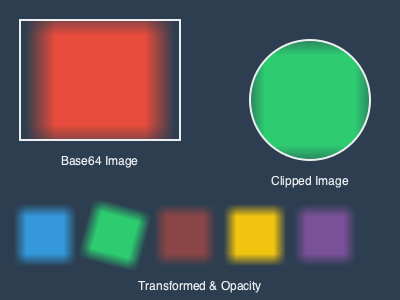 | 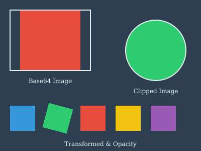 |

### 19 — Advanced Text

Multi-span text (tspan), text-decoration, textPath on curves, and rotated text.

| Input SVG | JairoSVG | EchoSVG | CairoSVG | JSVG |
| :-------: | :------: | :-----: | :------: | :--: |
| [SVG](svg/19_text_advanced.svg) | 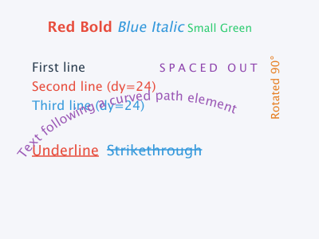 |  | 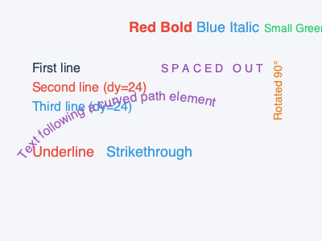 | 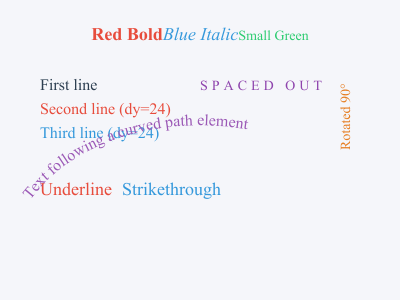 |

### 20 — feBlend Modes

feBlend modes: normal, multiply, screen, darken, and lighten.

| Input SVG | JairoSVG | EchoSVG | CairoSVG | JSVG |
| :-------: | :------: | :-----: | :------: | :--: |
| [SVG](svg/20_fe_blend_modes.svg) |  | 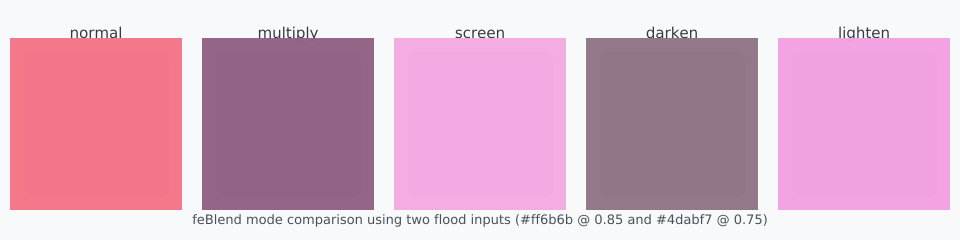 | 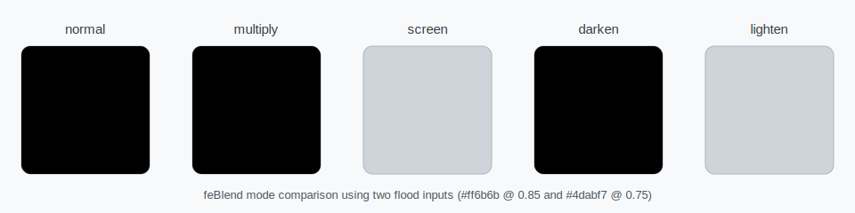 | 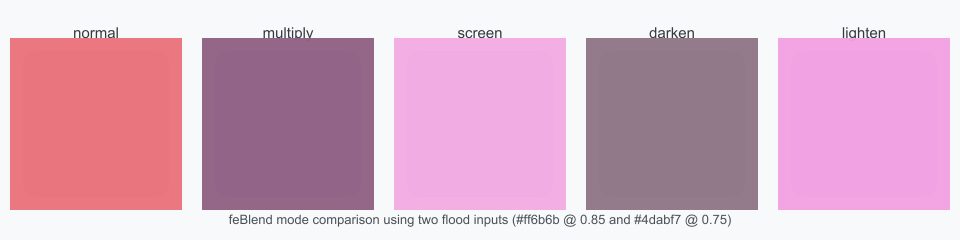 |

### 20_fe_tile

| Input SVG | JairoSVG | EchoSVG | CairoSVG | JSVG |
| :-------: | :------: | :-----: | :------: | :--: |
| [SVG](svg/20_fe_tile.svg) | 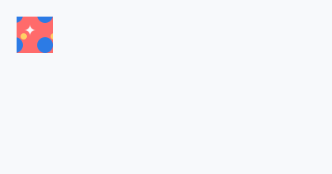 | 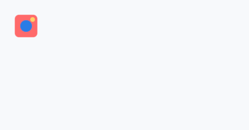 |  |  |

### 20_feimage_data_uri

| Input SVG | JairoSVG | EchoSVG | CairoSVG | JSVG |
| :-------: | :------: | :-----: | :------: | :--: |
| [SVG](svg/20_feimage_data_uri.svg) | 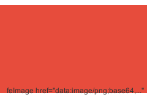 | 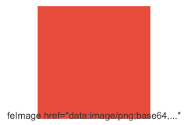 |  | 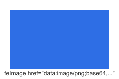 |

### 21_feimage_inline_ref

| Input SVG | JairoSVG | EchoSVG | CairoSVG | JSVG |
| :-------: | :------: | :-----: | :------: | :--: |
| [SVG](svg/21_feimage_inline_ref.svg) | 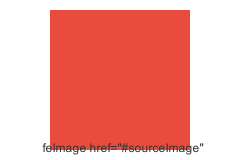 | 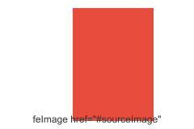 |  |  |

---

## Summary

| Dimension          | JairoSVG                                               | EchoSVG                                      | CairoSVG                                       | JSVG                                   |
| ------------------ | ------------------------------------------------------ | -------------------------------------------- | ---------------------------------------------- | -------------------------------------- |
| **Best for**       | Fast Java SVG conversion                               | Full SVG toolkit (DOM, scripting, animation) | Python SVG conversion                          | SVG rendering in Swing/Java2D GUIs     |
| **SVG spec**       | SVG 1.1 (static)                                       | SVG 1.1 + partial SVG 2                      | SVG 1.1 (static)                               | SVG 1.1 + partial SVG 2               |
| **CSS**            | Basic + structural pseudo selectors                    | Advanced (CSS Level 4, css4j)                | Basic (via tinycss2)                           | Good CSS support                       |
| **Performance**    | 2–31× faster than EchoSVG; on par with JSVG; 1–2.5× faster than CairoSVG | Slowest (GVT overhead)                       | Fast (native C), but skips some filter effects | Fast (lightweight, designed for Swing) |
| **API simplicity** | One-liner / builder                                    | Transcoder pattern                           | One-liner functions                            | SVGLoader + render()                   |
| **Codebase**       | ~4K LOC, 1 dep                                         | ~200K+ LOC, many modules                     | ~4K LOC, 5 deps                                | ~30K LOC, minimal deps                 |
| **Animation**      | ❌                                                     | ✅                                           | ❌                                             | ❌                                     |
| **Scripting**      | ❌                                                     | ✅                                           | ❌                                             | ❌                                     |
| **GUI viewer**     | ❌                                                     | ✅                                           | ❌                                             | ✅ (Swing component)                   |
| **License**        | LGPL-3.0                                               | Apache-2.0                                   | LGPL-3.0                                       | MIT                                    |

---

## When to Choose Which

**Choose JairoSVG when you need:**

- True cross-platform, fast, lightweight SVG → PNG/PDF conversion
- Minimal dependencies and small deployment footprint
- A simple, fluent Java API
- Server-side batch rendering where startup time and throughput matter
- A secure default configuration with no scripting surface
- GraalVM Native Image compatibility

**Choose EchoSVG when you need:**

- A full SVG toolkit with DOM manipulation, scripting, and animation
- Advanced CSS support (Level 4 selectors, `calc()`, modern color functions)
- A Swing-based SVG viewer component
- Advanced SVG toolkit capabilities beyond conversion (DOM, scripting, animation)
- Compatibility with Java 11–24 (JairoSVG requires Java 25+)
- `foreignObject` support or SVG font rendering
- Migrating from Apache Batik

**Choose CairoSVG when you need:**

- SVG conversion **in Python**
- The fastest raw conversion speed (native C backend)
- A mature, widely-used library with a large community
- Integration with Python web frameworks or data pipelines
- No JVM dependency

**Choose JSVG when you need:**

- A lightweight SVG renderer to embed in a **Swing/Java2D GUI application**
- A Swing component to display SVG icons or diagrams interactively
- Compatibility with Java 11+ (JairoSVG requires Java 25+)
- MIT-licensed code with minimal dependencies
- An actively maintained renderer optimized for IntelliJ Platform and similar desktop apps

---

### JairoSVG Porting Fidelity

Since JairoSVG is a port of CairoSVG, most features should be at parity. Key differences:

| Feature                           |   JairoSVG (Java port)   | CairoSVG (Python original) |
| --------------------------------- | :----------------------: | :------------------------: |
| `<symbol>` element                |            ✅            |             ❌             |
| `font` shorthand                  |            ✅            |             ❌             |
| EPS output                        |            ✅            |             ❌             |
| External CSS `<?xml-stylesheet?>` | ✅ (requires `--unsafe`) |             ✅             |
| Gzip-compressed `.svgz` input     |            ✅            |             ✅             |

JairoSVG adds features beyond CairoSVG (fluent builder API, `BufferedImage` output, EPS support) while maintaining the same core rendering approach.

---

## What About ImageMagick?

[ImageMagick](https://imagemagick.org/) is a popular command-line image processing toolkit that supports SVG as an input format. However, testing against the same 19 SVG test cases used in this comparison reveals that **ImageMagick is not a reliable SVG-to-PNG converter**. Out of 19 test cases, ImageMagick **failed on 11** (58%) — crashing, producing errors, or generating incorrect output.

### Failure Summary

| Category                      | Affected Test Cases        | Error                                                                                                                                                                    |
| ----------------------------- | -------------------------- | ------------------------------------------------------------------------------------------------------------------------------------------------------------------------ |
| **Font resolution**           | 04, 08, 09, 12, 13, 14, 17 | `unable to read font ''` — ImageMagick cannot resolve font families from SVG `<style>` blocks or `font-family` attributes                                                |
| **Crashes (segfaults)**       | 05, 18, 19                 | `malloc: pointer being freed was not allocated` / `Trace/BPT trap` — the built-in MSVG renderer crashes on complex transforms, embedded base64 images, and advanced text |
| **Gradient/paint references** | 15                         | `unrecognized color 'fadeLR'` — fails to resolve `url(#id)` gradient references used in masks                                                                            |

### Root Cause

ImageMagick's built-in SVG renderer (MSVG) is a minimal implementation that lacks:

- **CSS `<style>` parsing** — inline stylesheets are largely ignored
- **Font fallback** — if the exact font isn't found on the system, rendering fails entirely
- **Gradient/paint server resolution** — `url(#id)` references in fill/stroke are not reliably resolved
- **Robust memory management** — complex SVG inputs trigger segfaults and aborts

Even when ImageMagick can be configured to delegate SVG rendering to an external library (e.g., librsvg via `--delegate`), the default installation does not include this, and the built-in renderer is what most users encounter.

### Performance

Even for the 8 test cases where ImageMagick succeeds, performance is significantly worse than all three dedicated SVG libraries. Each conversion spawns a new `magick` process, so there is unavoidable process startup overhead. In the Gradients scenario, for example, **ImageMagick is roughly 10× slower than JairoSVG**.

### Verdict

ImageMagick is an excellent tool for raster image manipulation (resize, crop, compose, format conversion), but its SVG support is too limited for production use. For reliable SVG → PNG conversion, use a dedicated SVG library like JairoSVG, EchoSVG, or CairoSVG.

---

## Regenerating

Prerequisites: [JBang], Java 25+, Python 3 with CairoSVG (`python3 -m pip install cairosvg`), JairoSVG installed in local Maven repo.

```bash
./mvnw install -DskipTests
jbang comparison/generate.java
```

---

**All four libraries are complementary:** JairoSVG and CairoSVG share DNA and excel as fast conversion engines (Java and Python respectively), EchoSVG is a full SVG runtime, and JSVG is designed for lightweight GUI embedding.

<!-- Link references -->

[CairoSVG]: https://cairosvg.org
[Apache Batik]: https://xmlgraphics.apache.org/batik/
[brunoborges/jairosvg]: https://github.com/brunoborges/jairosvg
[css4j/echosvg]: https://github.com/css4j/echosvg
[Kozea/CairoSVG]: https://github.com/Kozea/CairoSVG
[weisJ/jsvg]: https://github.com/weisJ/jsvg
[JBang]: https://www.jbang.dev/
[#15]: https://github.com/brunoborges/jairosvg/issues/15
[#16]: https://github.com/brunoborges/jairosvg/issues/16
[#18]: https://github.com/brunoborges/jairosvg/issues/18
[#19]: https://github.com/brunoborges/jairosvg/issues/19
[#23]: https://github.com/brunoborges/jairosvg/issues/23
[#26]: https://github.com/brunoborges/jairosvg/issues/26
[#28]: https://github.com/brunoborges/jairosvg/issues/28
[#29]: https://github.com/brunoborges/jairosvg/issues/29
[#30]: https://github.com/brunoborges/jairosvg/issues/30
