# Visual Rendering Comparison

Side-by-side visual comparison of 42 SVG test cases across all four libraries.

> **Note:** The **Input SVG** column is rendered live by your browser's built-in SVG engine. Use it as a reference to compare each library's PNG output against what a modern browser produces.

### 01_basic_shapes

Rectangles, circles, ellipses, and lines with solid fills and strokes.

| Input SVG | JairoSVG | EchoSVG | CairoSVG | JSVG |
| :-------: | :------: | :-----: | :------: | :--: |
| 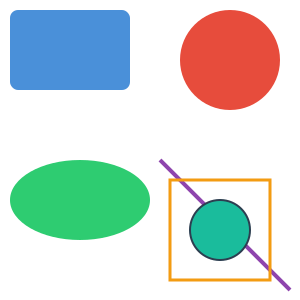 |  |  |  |  |

### 02_gradients

Linear and radial gradients with color stops and spread methods.

| Input SVG | JairoSVG | EchoSVG | CairoSVG | JSVG |
| :-------: | :------: | :-----: | :------: | :--: |
| 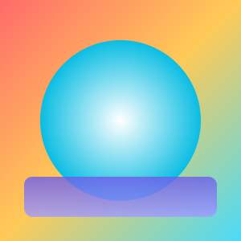 | 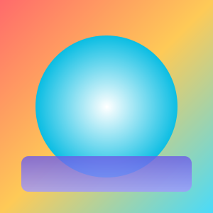 |  |  |  |

### 03_complex_paths

Cubic/quadratic Bézier curves, arcs, and complex path commands.

| Input SVG | JairoSVG | EchoSVG | CairoSVG | JSVG |
| :-------: | :------: | :-----: | :------: | :--: |
|  |  |  |  | 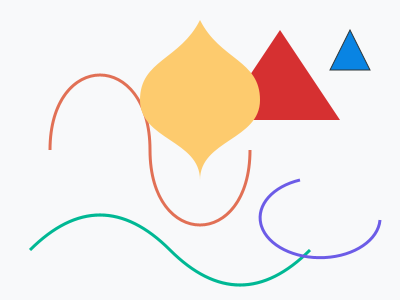 |

### 04_text_rendering

Text rendering with different fonts, sizes, weights, and tspan.

| Input SVG | JairoSVG | EchoSVG | CairoSVG | JSVG |
| :-------: | :------: | :-----: | :------: | :--: |
| 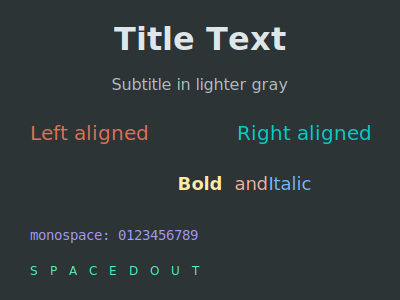 |  | 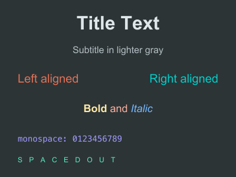 | 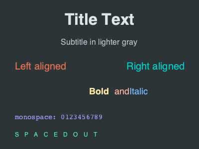 | 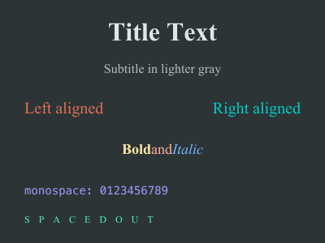 |

### 05_transforms

Translate, rotate, scale, skewX, and nested group transforms.

| Input SVG | JairoSVG | EchoSVG | CairoSVG | JSVG |
| :-------: | :------: | :-----: | :------: | :--: |
|  |  |  |  | 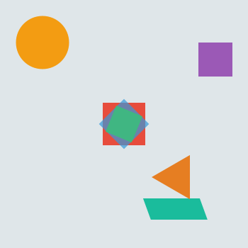 |

### 06_stroke_styles

Dash arrays, line caps (butt/round/square), and line joins.

| Input SVG | JairoSVG | EchoSVG | CairoSVG | JSVG |
| :-------: | :------: | :-----: | :------: | :--: |
| 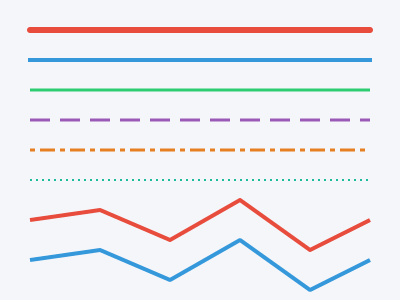 |  | 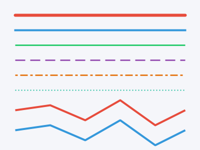 |  | 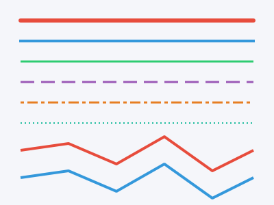 |

### 07_opacity_blend

Fill opacity, stroke opacity, and layered element opacity.

| Input SVG | JairoSVG | EchoSVG | CairoSVG | JSVG |
| :-------: | :------: | :-----: | :------: | :--: |
| 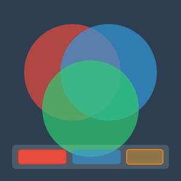 |  | 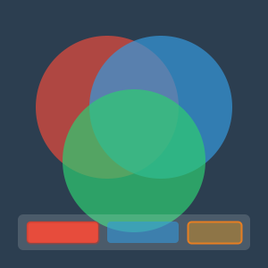 |  |  |

### 08_viewbox_aspect

viewBox scaling with different preserveAspectRatio values.

| Input SVG | JairoSVG | EchoSVG | CairoSVG | JSVG |
| :-------: | :------: | :-----: | :------: | :--: |
| 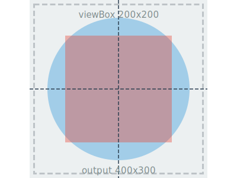 | 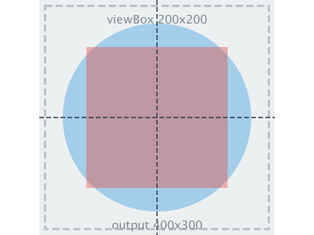 | 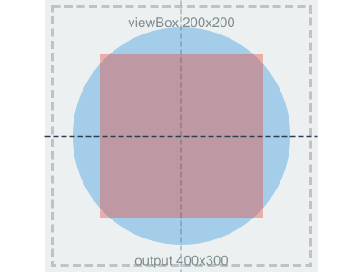 |  |  |

### 09_css_styling

CSS `<style>` block with class and ID selectors.

| Input SVG | JairoSVG | EchoSVG | CairoSVG | JSVG |
| :-------: | :------: | :-----: | :------: | :--: |
|  |  |  |  |  |

### 10_use_and_defs

`<use>` element references, `<clipPath>`, and `<defs>` reuse.

| Input SVG | JairoSVG | EchoSVG | CairoSVG | JSVG |
| :-------: | :------: | :-----: | :------: | :--: |
| 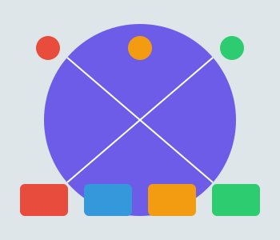 |  |  |  |  |

### 11_star_polygon

Complex star polygon with fill-rule evenodd.

| Input SVG | JairoSVG | EchoSVG | CairoSVG | JSVG |
| :-------: | :------: | :-----: | :------: | :--: |
|  |  |  |  |  |

### 12_nested_svg

Nested `<svg>` elements with independent viewports.

| Input SVG | JairoSVG | EchoSVG | CairoSVG | JSVG |
| :-------: | :------: | :-----: | :------: | :--: |
| 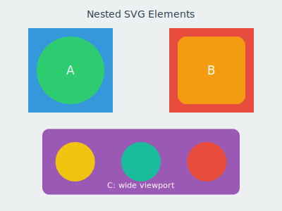 |  | 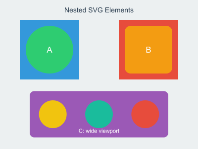 | 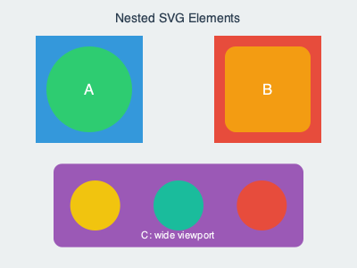 |  |

### 13_patterns

Tiled pattern fills: dots, cross-hatch stripes, and grid lines.

| Input SVG | JairoSVG | EchoSVG | CairoSVG | JSVG |
| :-------: | :------: | :-----: | :------: | :--: |
|  | 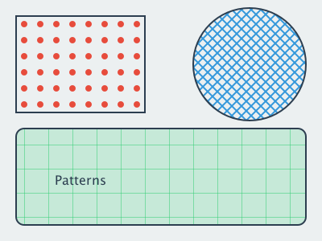 |  | 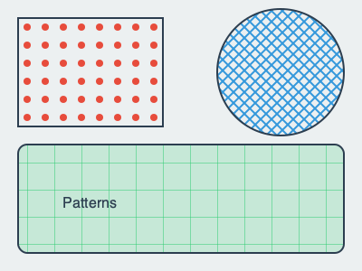 |  |

### 14_clip_paths

Star and text clip paths applied to gradient fills.

| Input SVG | JairoSVG | EchoSVG | CairoSVG | JSVG |
| :-------: | :------: | :-----: | :------: | :--: |
|  |  |  |  |  |

### 15_masks

Horizontal, vertical, and circular gradient masks with luminance blending.

| Input SVG | JairoSVG | EchoSVG | CairoSVG | JSVG |
| :-------: | :------: | :-----: | :------: | :--: |
| 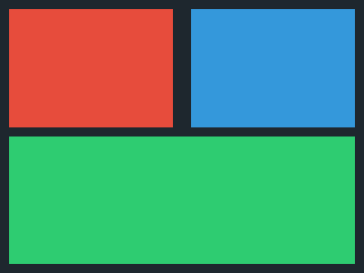 | 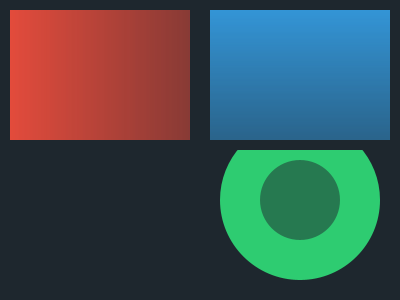 | 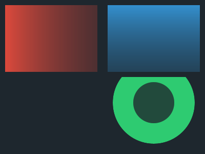 |  |  |

### 16_markers

Arrow, dot, and square markers on lines, polylines, and curves.

| Input SVG | JairoSVG | EchoSVG | CairoSVG | JSVG |
| :-------: | :------: | :-----: | :------: | :--: |
| 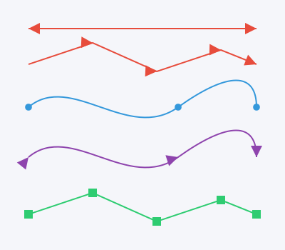 |  |  |  |  |

### 17_filters

Gaussian blur and drop-shadow filters on shapes and text.

| Input SVG | JairoSVG | EchoSVG | CairoSVG | JSVG |
| :-------: | :------: | :-----: | :------: | :--: |
|  |  |  | 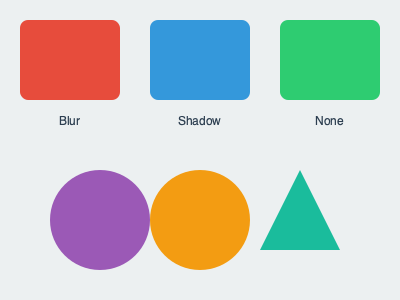 | 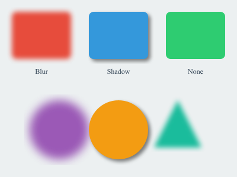 |

### 18_embedded_image

Base64-encoded PNG images with clipping, transforms, and opacity.

| Input SVG | JairoSVG | EchoSVG | CairoSVG | JSVG |
| :-------: | :------: | :-----: | :------: | :--: |
|  | 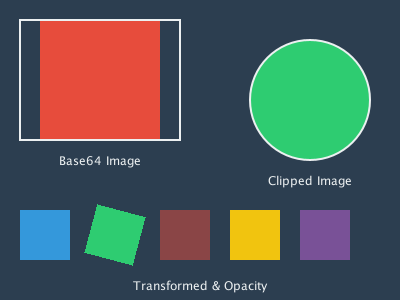 |  | 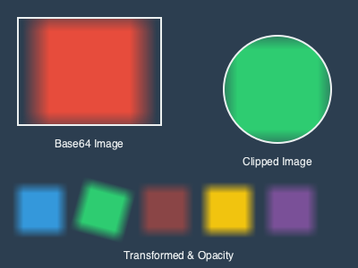 | 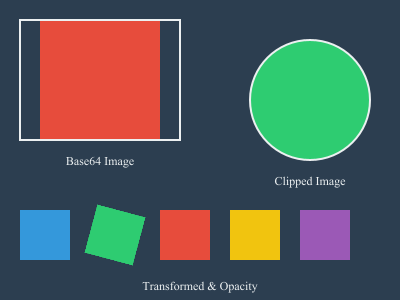 |

### 19_text_advanced

Multi-span text (tspan), text-decoration, textPath on curves, and rotated text.

| Input SVG | JairoSVG | EchoSVG | CairoSVG | JSVG |
| :-------: | :------: | :-----: | :------: | :--: |
| 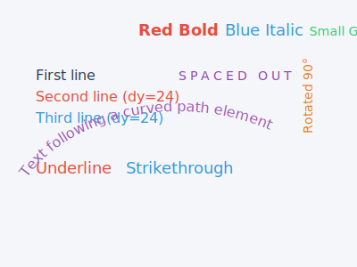 | 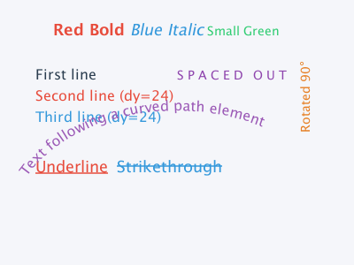 | 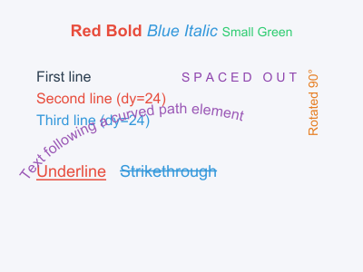 | 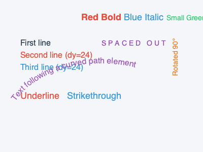 |  |

### 20_fe_blend_modes

feBlend modes: normal, multiply, screen, darken, and lighten.

| Input SVG | JairoSVG | EchoSVG | CairoSVG | JSVG |
| :-------: | :------: | :-----: | :------: | :--: |
| 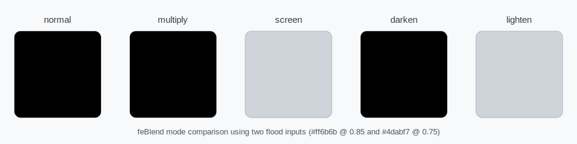 | 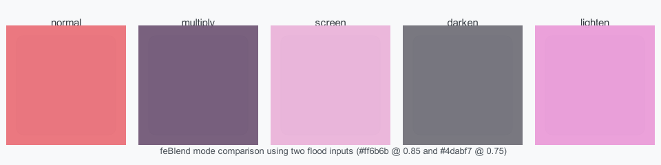 | 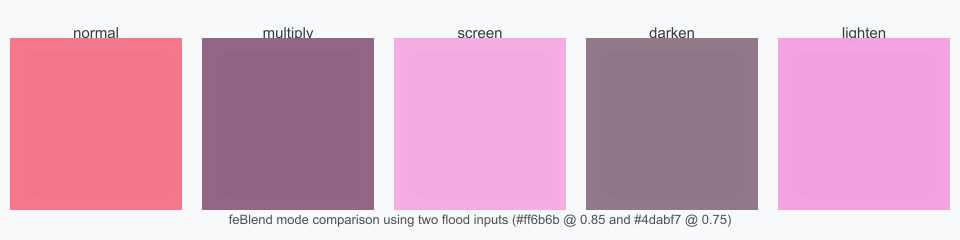 | 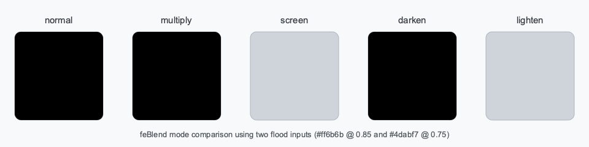 |  |

### 21_fe_tile

`feTile` filter primitive: repeating input across the filter region.

| Input SVG | JairoSVG | EchoSVG | CairoSVG | JSVG |
| :-------: | :------: | :-----: | :------: | :--: |
|  |  |  |  |  |

### 22_feimage_data_uri

`feImage` with data-URI PNG source.

| Input SVG | JairoSVG | EchoSVG | CairoSVG | JSVG |
| :-------: | :------: | :-----: | :------: | :--: |
| 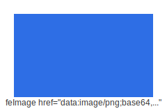 |  |  | 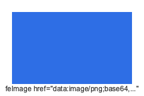 |  |

### 23_feimage_inline_ref

`feImage` referencing an inline SVG element by fragment ID.

| Input SVG | JairoSVG | EchoSVG | CairoSVG | JSVG |
| :-------: | :------: | :-----: | :------: | :--: |
| 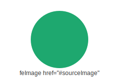 |  |  | 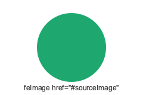 | 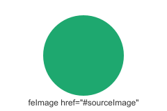 |

### 24_localized_masks

Masks with localized coordinate systems and gradient fills.

| Input SVG | JairoSVG | EchoSVG | CairoSVG | JSVG |
| :-------: | :------: | :-----: | :------: | :--: |
| 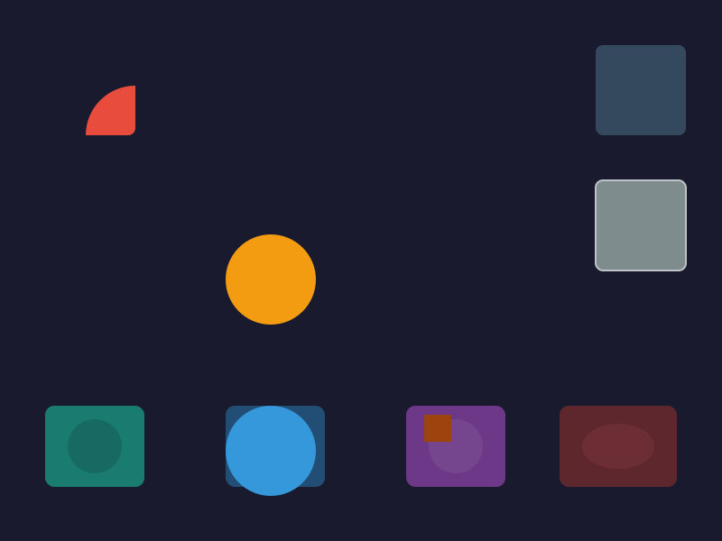 | 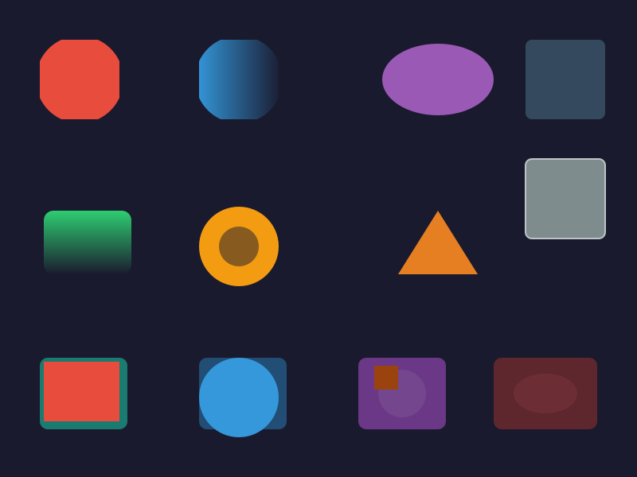 | 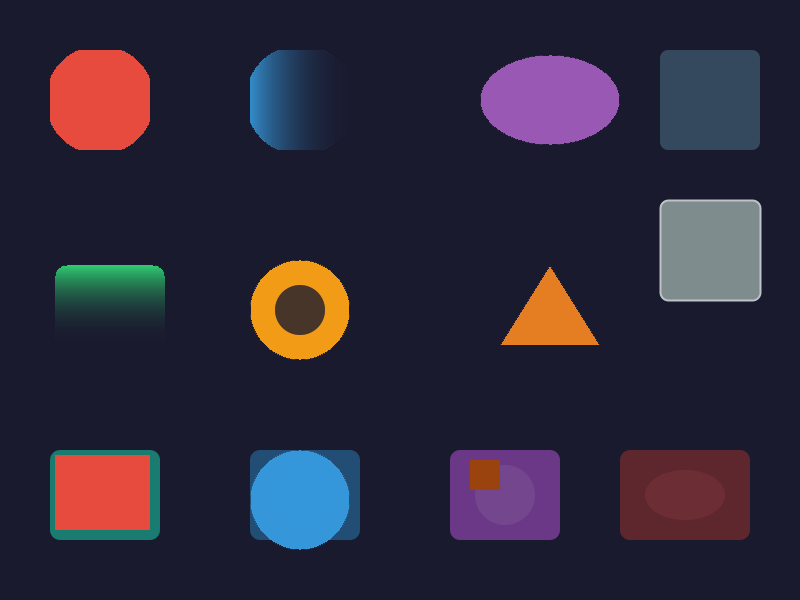 |  |  |

### 25_svg_fonts

Custom SVG font with glyph paths and missing-glyph fallback.

| Input SVG | JairoSVG | EchoSVG | CairoSVG | JSVG |
| :-------: | :------: | :-----: | :------: | :--: |
| 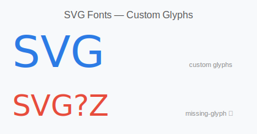 | 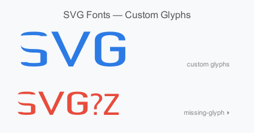 |  |  |  |

### 26_symbol_use

Reusable `<symbol>` elements instantiated with `<use>` at different sizes and positions.

| Input SVG | JairoSVG | EchoSVG | CairoSVG | JSVG |
| :-------: | :------: | :-----: | :------: | :--: |
|  |  |  |  |  |

### 27_switch_features

`<switch>` element with requiredFeatures and systemLanguage conditional rendering.

| Input SVG | JairoSVG | EchoSVG | CairoSVG | JSVG |
| :-------: | :------: | :-----: | :------: | :--: |
|  |  |  |  |  |

### 28_css_variables

CSS custom properties with `var()` function and fallback values.

| Input SVG | JairoSVG | EchoSVG | CairoSVG | JSVG |
| :-------: | :------: | :-----: | :------: | :--: |
|  |  |  | — |  |

### 29_current_color

`currentColor` keyword for fill, stroke, and gradient stops with nested inheritance.

| Input SVG | JairoSVG | EchoSVG | CairoSVG | JSVG |
| :-------: | :------: | :-----: | :------: | :--: |
|  |  |  |  |  |

### 30_display_visibility

`display:none` vs `visibility:hidden` behavior, group suppression, and child override.

| Input SVG | JairoSVG | EchoSVG | CairoSVG | JSVG |
| :-------: | :------: | :-----: | :------: | :--: |
|  |  |  |  |  |

### 31_nested_overflow

Nested `<svg>` elements with `overflow` values: hidden, scroll, visible, and auto.

| Input SVG | JairoSVG | EchoSVG | CairoSVG | JSVG |
| :-------: | :------: | :-----: | :------: | :--: |
|  |  |  |  |  |

### 32_stroke_advanced

`stroke-dashoffset` phase shifting and `stroke-miterlimit` miter-to-bevel fallback.

| Input SVG | JairoSVG | EchoSVG | CairoSVG | JSVG |
| :-------: | :------: | :-----: | :------: | :--: |
|  |  |  |  |  |

### 33_pattern_transforms

`patternTransform` with scale, rotate, translate, and combined transforms.

| Input SVG | JairoSVG | EchoSVG | CairoSVG | JSVG |
| :-------: | :------: | :-----: | :------: | :--: |
|  |  |  |  |  |

### 34_gradient_advanced

Gradient `spreadMethod` (reflect/repeat/pad), `fx`/`fy` focus, `href` inheritance, and `userSpaceOnUse`.

| Input SVG | JairoSVG | EchoSVG | CairoSVG | JSVG |
| :-------: | :------: | :-----: | :------: | :--: |
|  |  |  |  |  |

### 35_filter_merge_offset

`feMerge` for compositing layers and `feOffset` for position shifting with shadow effects.

| Input SVG | JairoSVG | EchoSVG | CairoSVG | JSVG |
| :-------: | :------: | :-----: | :------: | :--: |
|  |  |  |  |  |

### 36_fe_color_matrix

`feColorMatrix` with type matrix, saturate, hueRotate, and luminanceToAlpha.

| Input SVG | JairoSVG | EchoSVG | CairoSVG | JSVG |
| :-------: | :------: | :-----: | :------: | :--: |
|  |  |  |  |  |

### 37_fe_morphology

`feMorphology` erode and dilate operators on text, shapes, and circles.

| Input SVG | JairoSVG | EchoSVG | CairoSVG | JSVG |
| :-------: | :------: | :-----: | :------: | :--: |
|  |  |  |  |  |

### 38_fe_turbulence

`feTurbulence` fractalNoise and turbulence types with varying frequency and octaves.

| Input SVG | JairoSVG | EchoSVG | CairoSVG | JSVG |
| :-------: | :------: | :-----: | :------: | :--: |
|  |  |  |  |  |

### 39_fe_displacement_map

`feDisplacementMap` distortion using a turbulence displacement source.

| Input SVG | JairoSVG | EchoSVG | CairoSVG | JSVG |
| :-------: | :------: | :-----: | :------: | :--: |
|  |  |  |  |  |

### 40_fe_lighting

`feDiffuseLighting` and `feSpecularLighting` with distant and point light sources.

| Input SVG | JairoSVG | EchoSVG | CairoSVG | JSVG |
| :-------: | :------: | :-----: | :------: | :--: |
|  |  |  |  |  |

### 41_fe_convolve_matrix

`feConvolveMatrix` convolution effects: emboss, edge detection, sharpen, and box blur.

| Input SVG | JairoSVG | EchoSVG | CairoSVG | JSVG |
| :-------: | :------: | :-----: | :------: | :--: |
|  |  |  |  |  |

### 42_fe_component_transfer

`feComponentTransfer` with gamma, discrete, linear, and table transfer functions.

| Input SVG | JairoSVG | EchoSVG | CairoSVG | JSVG |
| :-------: | :------: | :-----: | :------: | :--: |
|  |  |  |  |  |
